# The one-shot card

Generated by `site/scripts/gen-docs.mjs` from the pages of the documentation site named under each heading below: do not edit this file. Change the page, and its Spanish twin beside it, then run `make docs`.

## Overview

A self-contained SVG for a profile README, drawn from the same points the databases receive.

Source: <https://jmrp.io/docs/ghchronicle/card/>

```sh
ghchronicle -config config.yaml -card card.svg -card-only
```

> **This is a side feature**
>
> The point of the project is the ingestion. The card exists because the numbers
> were already there, and it is drawn from exactly the same points the databases
> receive, so the card and the dashboard cannot disagree.

### The flags

| Flag                                    | Does                                                         |
| --------------------------------------- | ------------------------------------------------------------ |
| `-card <path>`                          | Runs one sweep and writes the SVG there                      |
| `-card-only`                            | Writes the SVG and nothing else, so no database is needed    |
| `-card-layout <name>`                   | One of the thirteen [layouts](https://jmrp.io/docs/ghchronicle/card/layouts/)    |
| `-card-theme <dark\|light\|auto\|both>` | Both writes the light card and a `_dark` twin from one sweep |
| `-card-motion <once\|loop\|off>`        | How an animated layout moves; the others ignore it           |
| `-card-fields <list>`                   | Comma-separated, in drawing order                            |
| `-card-width <pixels>`                  | The layout's own width when left out; on `activity-heatmap` it buys weeks |
| `-card-speed <0 to 1>`                  | How fast an animated layout plays; `0.5`, the default, is the pace it always had |
| `-card-layouts`                         | Prints the layouts with their fields and widths, then exits  |

Without `-card-only` the card is written **as well as** everything the sinks
would normally get, which is the arrangement for a host that is already
collecting and wants a picture too.

### The card run and the state file

A run given `-card` collects **every family**, whatever the cadences say,
because every number on the card comes from the points of that one sweep and a
family skipped as not due would be a zero on the picture.

With `-card-only` it also leaves the [state
file](https://jmrp.io/docs/ghchronicle/configuration/#state_file) exactly as it found it. Nothing
that run collected reached a store, so nothing it learned may tell the next
collection that a family is already done. It still reads the file, which is
what lets it skip the one-off walk of the star history: what the state
remembers makes the sweep cheaper, never the card smaller.

So a card, a second card and a collection can all share one `state_file`, and
each of them is the whole account.

### What it draws

Stars, forks, followers and repository count; contributions over the last year;
views and unique visitors over GitHub's fourteen-day traffic window; a
sparkline of the contribution calendar; and the top repositories by stars with
their language.

Stars and forks are **summed from the repositories the sweep collected**,
because GitHub's account endpoint reports neither total. That means excluding
forks or archived repositories in `targets` is visible on the card too, which
is the honest reading rather than a hidden discrepancy.

### The fields

`-card-fields` takes a comma-separated list, in drawing order, from:

`stars`, `forks`, `followers`, `repos`, `contributions`, `views`, `visitors`,
`clones`, `commits`, `pull_requests`, `reviews`, `issues`, `languages`,
`top_repos`, `sparkline`.

A layout skips a field it cannot draw. An unknown name is an error that lists
the valid ones, rather than a silent skip: a typo would otherwise remove a
number and nobody would notice until the card was already committed.

```sh
ghchronicle -config config.yaml -card card.svg -card-only \
  -card-layout github-stats -card-theme dark \
  -card-fields repos,stars,forks,followers,commits,pull_requests,languages
```

Empty means the layout's default set.

### Themes

- **dark and light**

  One palette each, and the choice for a README. `-card-theme both` (or
  `card-theme: both` in the Action) writes the light card at the path given
  and the dark one beside it with `_dark` before the extension, from the same
  sweep, so the two can never disagree. Put both in a `<picture>`, the way
  GitHub documents showing a different picture per theme:

  ```html
  <picture><source media="(prefers-color-scheme: dark)" srcset="card_dark.svg"></picture>
  ```

  This project's own README does exactly that with its cards.

- **auto**

  Both palettes in one file, behind a `prefers-color-scheme` query inside the
  picture. The query follows the reader's operating system rather than the
  theme they chose on the page, and a browser does not reliably evaluate it
  again inside an image: on GitHub, auto cards were seen switching palettes on
  a dark page after the tab was left and come back to. It suits a page with no
  theme of its own. For a README, use the two files.

### Three constraints it respects

**Self-contained.** No external stylesheet, no webfont, no `<image>` pointing
at a URL, no script. GitHub's camo proxy serves README images from its own
domain and blocks all of that, so anything external would simply not render.

**Deterministic.** The same input produces a byte-identical file, so a
scheduled job that commits the card does not produce a diff on every run.

**Written atomically.** Rendered to a temporary file and renamed, so a reader
watching the path never sees half a document.

### Motion

Animation, where a layout has it, is CSS inside the SVG, and there is no
script, ever. Every animation ends on the complete static card, so a renderer
that ignores animation shows the finished state, and `prefers-reduced-motion`
switches it off in every mode.

| `-card-motion` | What the card does                                                          |
| -------------- | --------------------------------------------------------------------------- |
| `once`         | Plays when it loads and settles. The default                                |
| `loop`         | The same, and whatever the layout has that never ends goes on for ever      |
| `off`          | No animation at all, and a smaller file                                     |

#### A loop never replays

An animation here reveals content: a number counts up to what it is, a bar
grows to its share, a line draws itself. Playing that again would take back
something the reader has already been shown, and a card that keeps hiding its
own figures is worse than a still one.

So `loop` does not mean "and again". The reveal plays once and settles in both
modes, and the only thing that may go on for ever is motion that puts nothing on
the card and takes nothing off it. Two layouts have such a thing:

- `terminal`, whose cursor blinks at its prompt from the moment the window is
  drawn. The numbers still type themselves in once. Played `once` instead, the
  cursor waits for the last of them, blinks a couple of times and settles lit.
- `ticker`, whose band of pills keeps scrolling. Nothing disappears; the same
  pills come round again.

On every other layout `loop` draws exactly the card `once` draws, to the byte.
It is accepted rather than refused, so a workflow can set it once and change
`card-layout` freely.

`once` is still the considerate default for a profile, and more so than before.
A card that loops moves for everyone who opens the README, and neither of the
two that can is paced: the cursor blinks and the band scrolls with no pause
between passes, where the looping cards this replaced held still for seven
seconds between plays. A README gives a reader no way to stop it. Their only
escape is `prefers-reduced-motion`, which switches the animation off for them
but is a setting for their whole machine, not a control over your card. That is
the same reason the layouts page never shows a card looping until the reader
presses the toggle (WCAG 2.2.2, Pause, Stop, Hide).


- **Binary**

  ```sh
  ghchronicle -card-layout terminal -card-theme both -card-only -card card.svg -config config.yaml
  ```

  The looping picture:

  ```sh
  ghchronicle -card-layout terminal -card-theme both -card-only -card card.svg -config config.yaml -card-motion loop
  ```

- **GitHub Action**

  ```yaml
  - uses: jmrplens/ghchronicle@v1
    with:
      token: ${{ secrets.GHCHRONICLE_TOKEN }}
      mode: card
      card: generated/card.svg
      card-layout: terminal
      card-theme: both
  ```

  The looping picture:

  ```yaml
  - uses: jmrplens/ghchronicle@v1
    with:
      token: ${{ secrets.GHCHRONICLE_TOKEN }}
      mode: card
      card: generated/card.svg
      card-layout: terminal
      card-theme: both
      card-motion: loop
  ```

#### How fast it plays

`-card-speed` is a decimal from 0 to 1, and 0.5 is the default. It is one
number for the whole card: every animated layout scales by it, the two
continuous motions with the reveals, so a card set slower has a band that takes
longer to come round and a cursor that blinks more slowly at the same time.

| `-card-speed` | What the card does                                                     |
| ------------- | ---------------------------------------------------------------------- |
| `0`           | The slowest animation, twice the length of the default                 |
| `0.5`         | Exactly the card this renderer always drew, to the byte. The default   |
| `1`           | The fastest, half the length of the default                            |

There is one knob and not one per layout for the reason there is one width and
not one per layout: the cycles here were paced against each other, and scaling
them together is what keeps the pacing the motion was designed with. A speed
outside the range is refused before the sweep runs, naming both ends.

> **0 is the slowest animation, not none**
>
> A range that starts at zero reads like a switch, and this one is not. A card
> drawn at `0` still animates, as slowly as this renderer will draw it. The one
> that draws no animation at all is `-card-motion off`, and it is also the one
> that makes the file smaller.

`prefers-reduced-motion` is untouched by any of this: a reader who has asked
his machine for less motion gets no animation to slow down or speed up.

### In a README

```html
<picture><source media="(prefers-color-scheme: dark)" srcset="generated/card_dark.svg"></picture>
```

The workflow that keeps it current, for a profile README or any other, is in
[A card in your profile README](https://jmrp.io/docs/ghchronicle/install/actions/#a-card-in-your-profile-readme).

### There is no Go library

The renderer lives in `internal/render`, and Go refuses that import from
outside the module, so there is no way to draw a card from your own program by
calling into this one. A program that wants an SVG runs the binary with
`-card` and reads the file, the same way it would run any other command: see
[calling it from a program](https://jmrp.io/docs/ghchronicle/reference/subprocess/).

## Layouts

Thirteen layouts in two visual families, with what each one draws by default, which of them animate and which of them can keep going.

Source: <https://jmrp.io/docs/ghchronicle/card/layouts/>

```sh
ghchronicle -card-layouts
```

Prints them with the fields each shows by default. Every layout below has a
section of its own, stating its family, its motion, the width it is drawn at
and those fields, over a picture of the card. Each card is shown in the palette
this page is in, light or dark; every layout draws both, and `auto` puts both
in one file.

Where a layout animates, the animation plays once and settles on the complete
static card, so every picture below is that settled frame and not a moment in
the middle of one. How that is set, and what switches it off, is
[Motion](https://jmrp.io/docs/ghchronicle/card/#motion).

### The two families

The **chronicle** family is this tool's own look. The **github** family uses
GitHub's Primer palette and monospace numbers so the card sits in a profile
README as if GitHub had drawn it.

> **The command under each card**
>
> Under each picture, **Command for** opens the command that draws that card
> from your own account, and the same card as a step of the
> [Action](https://jmrp.io/docs/ghchronicle/install/actions/#a-card-in-your-profile-readme).
> `config.yaml` is your configuration, and `-card-theme both` writes two files,
> `card.svg` and `card_dark.svg`, which is how a page or a README shows the card
> in its own palette. On the two cards that loop, pressing the loop toggle adds
> `-card-motion loop`. The numbers a card draws are chosen with `-card-fields`,
> and every flag is on [the card](https://jmrp.io/docs/ghchronicle/card/#the-flags).

### summary

The original card: title, two rows of numbers, a sparkline and the most starred
repositories.

- **Family**: chronicle
- **Motion**: still
- **Width**: 495 px, drawn from 300 to 1200
- **Default fields**: `stars`, `forks`, `followers`, `repos`, `contributions`, `views`, `visitors`, `sparkline`, `top_repos`

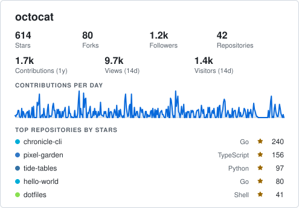

- **Binary**

  ```sh
  ghchronicle -card-layout summary -card-theme both -card-only -card card.svg -config config.yaml
  ```

- **GitHub Action**

  ```yaml
  - uses: jmrplens/ghchronicle@v1
    with:
      token: ${{ secrets.GHCHRONICLE_TOKEN }}
      mode: card
      card: generated/card.svg
      card-layout: summary
      card-theme: both
  ```

### github-stats

GitHub's own box: a header band, rows of four monospace numbers and a language
share bar with its legend. The widest of them, and the one that looks most
native in a profile README. The numbers count up, and the bar grows in from its
left edge once they have landed.

- **Family**: github
- **Motion**: plays once
- **Width**: 800 px, drawn from 600 to 1200
- **Default fields**: `repos`, `stars`, `forks`, `followers`, `commits`, `pull_requests`, `views`, `clones`, `languages`

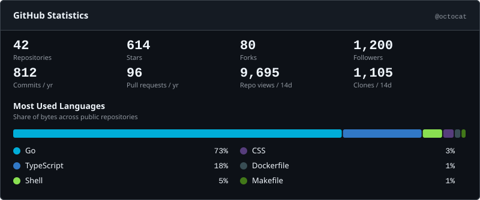

- **Binary**

  ```sh
  ghchronicle -card-layout github-stats -card-theme both -card-only -card card.svg -config config.yaml
  ```

- **GitHub Action**

  ```yaml
  - uses: jmrplens/ghchronicle@v1
    with:
      token: ${{ secrets.GHCHRONICLE_TOKEN }}
      mode: card
      card: generated/card.svg
      card-layout: github-stats
      card-theme: both
  ```

### github-compact

One row of monospace numbers under a thin header band.

- **Family**: github
- **Motion**: still
- **Width**: 495 px, drawn from 300 to 1200
- **Default fields**: `stars`, `forks`, `followers`, `repos`, `commits`

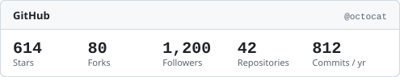

- **Binary**

  ```sh
  ghchronicle -card-layout github-compact -card-theme both -card-only -card card.svg -config config.yaml
  ```

- **GitHub Action**

  ```yaml
  - uses: jmrplens/ghchronicle@v1
    with:
      token: ${{ secrets.GHCHRONICLE_TOKEN }}
      mode: card
      card: generated/card.svg
      card-layout: github-compact
      card-theme: both
  ```

### badge-row

A row of 20 pixel pill badges, one per number, for a README line.

- **Family**: chronicle
- **Motion**: still
- **Width**: follows its content
- **Default fields**: `stars`, `forks`, `followers`, `repos`, `contributions`


- **Binary**

  ```sh
  ghchronicle -card-layout badge-row -card-theme both -card-only -card card.svg -config config.yaml
  ```

- **GitHub Action**

  ```yaml
  - uses: jmrplens/ghchronicle@v1
    with:
      token: ${{ secrets.GHCHRONICLE_TOKEN }}
      mode: card
      card: generated/card.svg
      card-layout: badge-row
      card-theme: both
  ```

### wide-banner

A full-width 60 pixel banner: login on the left, numbers spread across, the
sparkline drawing itself behind them.

- **Family**: chronicle
- **Motion**: plays once
- **Width**: 800 px, drawn from 500 to 1200
- **Default fields**: `stars`, `forks`, `followers`, `contributions`, `sparkline`


- **Binary**

  ```sh
  ghchronicle -card-layout wide-banner -card-theme both -card-only -card card.svg -config config.yaml
  ```

- **GitHub Action**

  ```yaml
  - uses: jmrplens/ghchronicle@v1
    with:
      token: ${{ secrets.GHCHRONICLE_TOKEN }}
      mode: card
      card: generated/card.svg
      card-layout: wide-banner
      card-theme: both
  ```

### sparkline-hero

The contribution sparkline is the whole card, with up to three numbers
overlaid. The line draws itself on load.

- **Family**: chronicle
- **Motion**: plays once
- **Width**: 495 px, drawn from 300 to 1200
- **Default fields**: `contributions`, `stars`, `followers`, `sparkline`


- **Binary**

  ```sh
  ghchronicle -card-layout sparkline-hero -card-theme both -card-only -card card.svg -config config.yaml
  ```

- **GitHub Action**

  ```yaml
  - uses: jmrplens/ghchronicle@v1
    with:
      token: ${{ secrets.GHCHRONICLE_TOKEN }}
      mode: card
      card: generated/card.svg
      card-layout: sparkline-hero
      card-theme: both
  ```

### language-ring

A donut of language shares with the legend beside it and a row of headline
numbers. Each slice draws itself around the ring after the one before it, and
the legend appears when the donut is whole.

- **Family**: github
- **Motion**: plays once
- **Width**: 495 px, drawn from 400 to 1200
- **Default fields**: `languages`, `stars`, `repos`

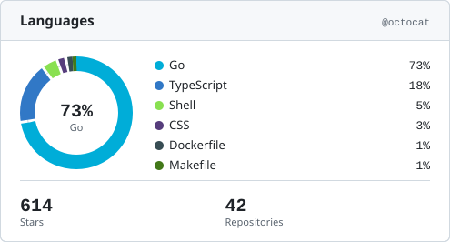

- **Binary**

  ```sh
  ghchronicle -card-layout language-ring -card-theme both -card-only -card card.svg -config config.yaml
  ```

- **GitHub Action**

  ```yaml
  - uses: jmrplens/ghchronicle@v1
    with:
      token: ${{ secrets.GHCHRONICLE_TOKEN }}
      mode: card
      card: generated/card.svg
      card-layout: language-ring
      card-theme: both
  ```

### repo-list

The most starred repositories as the main content: language dot, stars and a
bar per row, totals underneath.

- **Family**: github
- **Motion**: still
- **Width**: 495 px, drawn from 300 to 1200
- **Default fields**: `top_repos`, `stars`, `forks`, `repos`

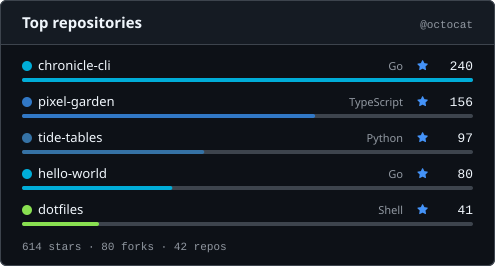

- **Binary**

  ```sh
  ghchronicle -card-layout repo-list -card-theme both -card-only -card card.svg -config config.yaml
  ```

- **GitHub Action**

  ```yaml
  - uses: jmrplens/ghchronicle@v1
    with:
      token: ${{ secrets.GHCHRONICLE_TOKEN }}
      mode: card
      card: generated/card.svg
      card-layout: repo-list
      card-theme: both
  ```

### activity-heatmap

As much of the contribution calendar as the width holds, up to a year of it, as
GitHub's green squares, with up to three numbers beside it. The week count is
not a fixed number: the grid takes whatever room the numbers beside it leave, so
it ends where the card does rather than stopping a third of the way short. At
the width this layout declares that is twenty-three weeks, at its minimum
sixteen, and `-card-width` at the far end its facts state draws the whole year
the collector keeps. An account whose numbers reach seven digits takes a wider
column for them and leaves the grid a week or two fewer, which is the same rule
seen from the other side: at the width this layout declares, a million
contributions is twenty-two weeks rather than twenty-three, and six digits
still fits inside the labels. The far end is where the year lands for the three
numbers this layout draws by default, so a card asked for fewer, or for numbers
with shorter labels, reaches the year before it and has room to spare at the
end: `-card-fields sparkline` draws its whole year well short of the far end.
The weeks fade in from the left, the wave crossing the grid in 0.22 s however
many weeks it holds, so the calendar fills in as a wave of the same length at
every width.

- **Family**: github
- **Motion**: plays once
- **Width**: 495 px, drawn from 400 to 891
- **Default fields**: `sparkline`, `contributions`, `commits`, `pull_requests`


- **Binary**

  ```sh
  ghchronicle -card-layout activity-heatmap -card-theme both -card-only -card card.svg -config config.yaml
  ```

- **GitHub Action**

  ```yaml
  - uses: jmrplens/ghchronicle@v1
    with:
      token: ${{ secrets.GHCHRONICLE_TOKEN }}
      mode: card
      card: generated/card.svg
      card-layout: activity-heatmap
      card-theme: both
  ```

### animated-counters

Numbers that count up on load over a sparkline that draws itself, settling to
the static card.

- **Family**: chronicle
- **Motion**: plays once
- **Width**: 495 px, drawn from 300 to 1200
- **Default fields**: `stars`, `forks`, `followers`, `repos`, `contributions`, `views`, `sparkline`


- **Binary**

  ```sh
  ghchronicle -card-layout animated-counters -card-theme both -card-only -card card.svg -config config.yaml
  ```

- **GitHub Action**

  ```yaml
  - uses: jmrplens/ghchronicle@v1
    with:
      token: ${{ secrets.GHCHRONICLE_TOKEN }}
      mode: card
      card: generated/card.svg
      card-layout: animated-counters
      card-theme: both
  ```

### terminal

A terminal window with the project's mark in its title bar, one line of output
per number and one per repository. The numbers type themselves in, a line at a
time, under a cover painted in the card's own background colour.

The cursor at the prompt is the card's one piece of endless motion, and it does
a different thing in each motion. Played `once` it sits lit while the numbers
arrive, blinks a couple of times when the last one lands and settles lit, which
is the state the finished card rests in. Under `loop` it blinks from the moment
the window is drawn and never stops, because a cursor blinks for the reason a
terminal is open and not for the reason a card is finished. The typing itself
happens once either way.

- **Family**: chronicle
- **Motion**: plays once, or in a loop
- **Width**: 495 px, drawn from 360 to 1200
- **Default fields**: `stars`, `forks`, `followers`, `repos`, `contributions`, `top_repos`


- **Binary**

  ```sh
  ghchronicle -card-layout terminal -card-theme both -card-only -card card.svg -config config.yaml
  ```

  The looping picture:

  ```sh
  ghchronicle -card-layout terminal -card-theme both -card-only -card card.svg -config config.yaml -card-motion loop
  ```

- **GitHub Action**

  ```yaml
  - uses: jmrplens/ghchronicle@v1
    with:
      token: ${{ secrets.GHCHRONICLE_TOKEN }}
      mode: card
      card: generated/card.svg
      card-layout: terminal
      card-theme: both
  ```

  The looping picture:

  ```yaml
  - uses: jmrplens/ghchronicle@v1
    with:
      token: ${{ secrets.GHCHRONICLE_TOKEN }}
      mode: card
      card: generated/card.svg
      card-layout: terminal
      card-theme: both
      card-motion: loop
  ```

### ticker

A band of pills, one per number and one per repository, scrolling from right to
left. The content is repeated end to end and the band moves by exactly one copy,
so the picture at the end of a pass is the picture at its start and the loop has
no seam. Played once, it makes a single pass and comes back to the beginning.
The band scrolls at a fixed speed, so a card with more in it takes longer to come
round than any other layout takes to settle.

- **Family**: chronicle
- **Motion**: plays once, or in a loop
- **Width**: 800 px, drawn from 400 to 1200
- **Default fields**: `stars`, `forks`, `followers`, `repos`, `contributions`, `commits`, `views`, `top_repos`

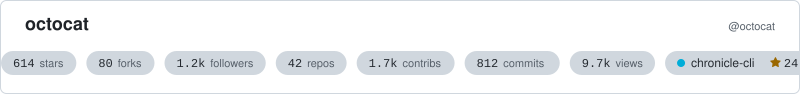

- **Binary**

  ```sh
  ghchronicle -card-layout ticker -card-theme both -card-only -card card.svg -config config.yaml
  ```

  The looping picture:

  ```sh
  ghchronicle -card-layout ticker -card-theme both -card-only -card card.svg -config config.yaml -card-motion loop
  ```

- **GitHub Action**

  ```yaml
  - uses: jmrplens/ghchronicle@v1
    with:
      token: ${{ secrets.GHCHRONICLE_TOKEN }}
      mode: card
      card: generated/card.svg
      card-layout: ticker
      card-theme: both
  ```

  The looping picture:

  ```yaml
  - uses: jmrplens/ghchronicle@v1
    with:
      token: ${{ secrets.GHCHRONICLE_TOKEN }}
      mode: card
      card: generated/card.svg
      card-layout: ticker
      card-theme: both
      card-motion: loop
  ```

### language-bars

One full-width bar per language, each growing from its own left edge after the
one above it, with the name and the share arriving once their own bar has
stopped. The layout that shows the share of a language as its own line, where
`language-ring` shows all of them in one donut and `github-stats` in one bar.

- **Family**: github
- **Motion**: plays once
- **Width**: 495 px, drawn from 360 to 1200
- **Default fields**: `languages`


- **Binary**

  ```sh
  ghchronicle -card-layout language-bars -card-theme both -card-only -card card.svg -config config.yaml
  ```

- **GitHub Action**

  ```yaml
  - uses: jmrplens/ghchronicle@v1
    with:
      token: ${{ secrets.GHCHRONICLE_TOKEN }}
      mode: card
      card: generated/card.svg
      card-layout: language-bars
      card-theme: both
  ```

### Motion

Each section above states its layout's motion, and one fact decides what that
line can say: a reveal is never replayed. A number that has counted up, a bar
that has grown and a line that has drawn itself are not taken back, so
`-card-motion loop` draws exactly the card `once` draws on every layout but the
two whose motion ends nothing, `terminal`'s blinking cursor and `ticker`'s
scrolling band. Those two are the ones with a loop toggle under their picture,
and the reasoning is in
[A loop never replays](https://jmrp.io/docs/ghchronicle/card/#a-loop-never-replays).

### Width

Each layout declares the width it is drawn at and the two ends it refuses to go
outside, and its own section above states all three. `-card-width` on the
binary, and `card-width` on the Action, ask for another: anything between that
layout's own two ends. A width outside them is refused before the sweep runs,
naming both, and `-card-layouts` prints them. Left out, a card comes out at its
layout's own width, which is what every card came out at before the flag
existed. `badge-row` declares none of the three, because a pill row stretched
to a fixed width would have gaps in it; its width follows its content, and the
flag neither changes it nor is refused by it.

The near end is where a column stops fitting. The far end is usually only a
guard against a typo, because a layout given more room spreads the same content
over it, and one asked for twenty thousand used to be drawn twenty thousand
units wide. `activity-heatmap` is the one with a real one, and it is the reason
the ends are each layout's own rather than one pair for all of them: it reads
the width rather than only being sized by it, working out how many weeks of the
contribution calendar fit in the room the width leaves, so the same card is
sixteen weeks at its near end, twenty-three at the width it declares and the
whole year the collector keeps at its far end. Past that there is no more
calendar to draw, so the far end is exactly the width where the year lands and
the card is never asked to fill space it has nothing for.

### Fields a layout cannot draw

Each layout declares which fields it supports. Asking for one it does not, such
as `top_repos` on `github-compact`, drops it silently. Asking for a name that is
not in the vocabulary at all is an error listing the valid ones.

Twelve of the fifteen fields are numbers, and every layout takes all twelve.
Only the three that need room of their own are restricted:

| Field        | Drawn by                                                          |
| ------------ | ----------------------------------------------------------------- |
| `languages`  | `summary`, `github-stats`, `language-ring`, `language-bars`       |
| `top_repos`  | `summary`, `github-stats`, `repo-list`, `terminal`, `ticker`      |
| `sparkline`  | `summary`, `github-stats`, `wide-banner`, `sparkline-hero`, `activity-heatmap`, `animated-counters` |

`ghchronicle -card-layouts` prints the layouts with the fields each one draws
by default.

### Where to go next

- [The card](https://jmrp.io/docs/ghchronicle/card/) is what draws these, and how to put one in a
  README.
- [Calling it from a program](https://jmrp.io/docs/ghchronicle/reference/subprocess/) is the
  supported way to get one out of another language.
