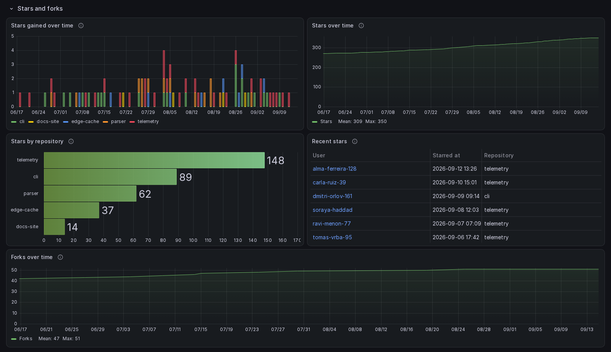
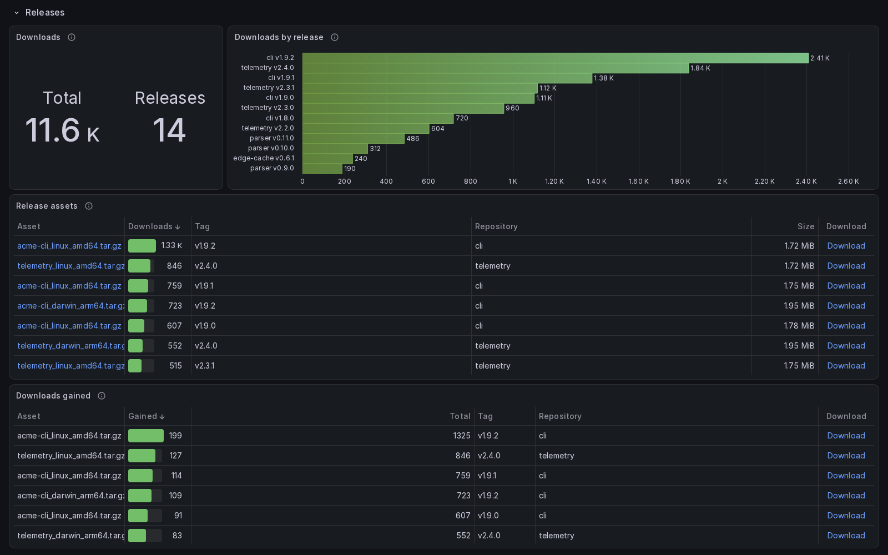
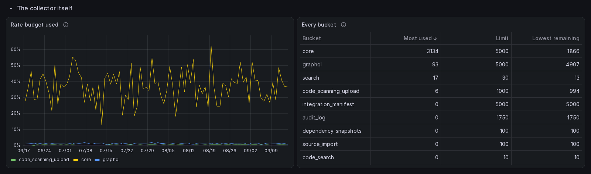

# Dashboards

Generated by `site/scripts/gen-docs.mjs` from the pages of the documentation site named under each heading below: do not edit this file. Change the page, and its Spanish twin beside it, then run `make docs`.

## Importing

Five generated Grafana dashboards, one per store, and how to import each of them.

Source: <https://jmrp.io/docs/ghchronicle/dashboards/>

Five dashboards, all in English, all in Grafana's shareable export format: the
datasource is a `${DS_...}` placeholder and the `__inputs` block asks the
importer to choose their own.

| File                             | Panels | Store                                                    |
| -------------------------------- | ------ | -------------------------------------------------------- |
| `ghchronicle-influxdb.json`      | 154 | InfluxDB 3, queried with SQL                             |
| `ghchronicle-prometheus.json`    | 154 | Prometheus                                               |
| `ghchronicle-postgres.json`      | 154 | PostgreSQL or TimescaleDB, from the SQL sink             |
| `ghchronicle-graphite.json`      | 154 | Graphite, from the Graphite sink                         |
| `ghchronicle-elasticsearch.json` | 154 | Elasticsearch or OpenSearch, from the Elasticsearch sink |

The five hold the same panels in the same order. What differs is how many of
them the store behind each one can answer.

Each cell is the panels that store answers with a query, out of the panels in that section. A panel a store cannot answer ships as a text panel with the same title, so every dashboard has the same 154 panels; the 2 that are prose in all five are left out here.

| Section | InfluxDB | PostgreSQL | Elasticsearch | Graphite | Prometheus | Panels |
| --- | --- | --- | --- | --- | --- | --- |
| Overview | 4 | 4 | 4 | 4 | 4 | 4 |
| Lifetime | 5 | 5 | 5 | 5 | 5 | 5 |
| Audience | 6 | 6 | 6 | 6 | 5 | 6 |
| Stars and forks | 5 | 5 | 5 | 5 | 5 | 5 |
| Contributions | 11 | 11 | 10 | 10 | 6 | 11 |
| Pull requests and issues | 14 | 14 | 14 | 14 | 10 | 14 |
| Continuous integration | 14 | 14 | 13 | 13 | 10 | 14 |
| Code | 9 | 9 | 8 | 8 | 8 | 9 |
| Planning and community | 10 | 10 | 10 | 10 | 8 | 10 |
| Delivery and access | 13 | 13 | 13 | 13 | 13 | 13 |
| Releases | 4 | 4 | 3 | 4 | 2 | 4 |
| Security | 14 | 14 | 14 | 13 | 13 | 14 |
| Cost | 6 | 6 | 6 | 6 | 6 | 6 |
| Activity | 9 | 9 | 9 | 8 | 7 | 9 |
| Inventory | 16 | 16 | 15 | 15 | 14 | 16 |
| Profile and sponsorship | 8 | 8 | 8 | 8 | 8 | 8 |
| The collector itself | 4 | 4 | 4 | 4 | 4 | 4 |
| **Total** | **152** | **152** | **147** | **146** | **128** | **152** |

![The InfluxDB dashboard over ninety days of the demonstration database: the repository picker and the range across the top, the Overview with the ghchronicle badge and four tile groups reading 5 repositories with 350 stars and 51 forks, 37.5 thousand views with 21.1 thousand unique visitors and 19.6 thousand clones, 117 followers and 58 following with 4 sponsors and 2 sponsored, and 3.22 thousand contributions over 7.78 years, then the collapsed Lifetime header and the Audience section with views, unique visitors and clones per day, the top referrers, the top paths and clone amplification](../site/src/assets/dashboard-influxdb-demo.png)

The account in that capture is the invented one every capture in this
documentation uses, `acme` and five repositories, described beside [what the
panels show](https://jmrp.io/docs/ghchronicle/dashboards/panels/). Every section but the Overview
ships collapsed, which is why Lifetime is a header there.

### Letting the binary do it

The dashboard is built from the same code the binary carries, so the binary can
publish it. Given a Grafana, it reconciles the datasource out of the sink it
already writes to, asks that datasource whether it can actually be reached, and
publishes the dashboard for every store it writes to.

```yaml
grafana:
  url: http://localhost:3000
  token: ${GRAFANA_TOKEN}
```

```sh
ghchronicle -config config.yaml -publish-dashboard
```

It asks GitHub nothing, so it needs no GitHub token, and it prints what it did
to each datasource and each dashboard.

> **Grafana often reaches the store by another address**
>
> The address the collector writes to and the address Grafana queries are
> frequently not the same one: a collector on the host writes to a published
> port while Grafana in a container reaches the same store by its name on the
> container network. Copying the sink's address across produces a datasource
> Grafana accepts and cannot use, so the run asks it before publishing and
> refuses on a datasource that does not answer. `grafana.datasource.url` is the
> address to use instead.

Two of the five sinks describe their own datasource with nothing else said,
because what they write to is what Grafana queries: InfluxDB and Elasticsearch.
Two more need the address and nothing else, because they write somewhere that
is not where a query goes: the Prometheus sink is scraped rather than written
to, and the Graphite sink speaks the ingest port while Grafana asks the web API
on another port. Give those the address and the datasource is made the same
way:

```yaml
grafana:
  datasource:
    url: http://prometheus:9090
```

The fifth cannot be told either. The SQL sink writes statements to a file and
never connects, so no host, port, user or password exists anywhere in the
config to build a datasource out of. That one, and any datasource you would
rather manage yourself, is named instead:

```yaml
grafana:
  datasource:
    uid: ae3x9k2
```

A datasource named that way is adopted and left exactly as it is, since
correcting one this did not make would overwrite settings nobody asked it to
have.

`publish_on_start: true` does the same once when the collector starts, before
the first sweep. It is off by default, and it is what keeps a server from
quietly falling behind the binary feeding it: the dashboard is generated from
the code, so updating the binary updates the dashboard. A failure there warns
and the sweep goes on, because the metrics of an hour spent not running cannot
be recovered and a dashboard published on the next restart can.

#### What it makes, and under which names

Nothing here is assigned by Grafana, so there is nothing to read back out of it
and write into your config. Both uids are worked out from the store's name, and
the same run twice writes to the same two places:

| Store           | Datasource uid              | Dashboard uid              |
| --------------- | --------------------------- | -------------------------- |
| `influxdb`      | `ghchronicle-influxdb`      | `ghchronicle-influxdb`     |
| `elasticsearch` | `ghchronicle-elasticsearch` | `ghchronicle-elasticsearch`|

The datasource is created the first time and corrected afterwards, and only the
fields this writes are compared, so a timeout or a description you set on it
yourself is left alone. One carrying a credential is written on every run,
because Grafana reports which secrets are set and never their values: a token
you rotate in the config cannot be seen from the outside, and writing it is the
only way to be sure the datasource is not still using the old one.

The dashboard is published with `overwrite`, so the second run updates the first
rather than adding another. That is what makes `publish_on_start` safe to leave
on.

A run also names what it finds under a uid it no longer writes to. Changing
which store the collector feeds is the case that leaves one: the old store's
dashboard and datasource stay where they are, pointing at something nobody
fills, and the new store's uid is a different string, so nothing overwrites
them. The note says which uid and which store, and stops there. Deleting a
dashboard unasked is not something a collector should do, even one it made: it
may be the copy still being read, or one edited since.

#### If the dashboard is already somewhere else

Importing the JSON through the UI keeps the uid the file carries, so a dashboard
imported that way is the one this writes over and there is nothing to do. It is
only different if Grafana was asked to import it as new, or if the uid was
changed by hand: then the generated uid is free, a publish makes a second
dashboard beside the one being looked at, and the one open stops being the one
updated. Name the existing one and it is written instead:

```yaml
grafana:
  dashboard_uid: my-existing-dashboard
```

#### Taking it all away again

`-uninstall` removes what this put in place, and only that. It takes the list
of what to remove, and without `-yes` it removes nothing and prints what it
would, because the alternative is one typed command that empties a store.

```sh
ghchronicle -config config.yaml -uninstall all          # says what would go
ghchronicle -config config.yaml -uninstall all -yes     # and then goes
```

| Target      | What goes                                                            |
| ----------- | -------------------------------------------------------------------- |
| `dashboard` | The dashboards it published, and a datasource it created              |
| `data`      | Every table in the store whose name starts with `gh_`                 |
| `state`     | The state file, the dedupe ledger and the backfill checkpoint         |
| `all`       | The three above                                                       |

A datasource named in `grafana.datasource.uid` is never removed: it was
somebody else's before this ran and it stays theirs. A target it does not
recognise is refused whole, rather than the rest of the list being carried out
without it.

The tables are asked of the store rather than compiled in. A list inside the
binary would be the measurements this version writes, and the ones worth
removing are exactly the ones nobody writes any more: what an older version
collected, or a family switched off since. Asking finds those.

Not every store can be emptied from here, and the ones that cannot say why
rather than staying silent, which would read as nothing to remove. Graphite
offers no delete, so its whisper files go by hand. The Prometheus sink is
scraped rather than written to, so nothing was stored to remove. The SQL sink's
file is removed, but rows already loaded from it into a real database were
loaded by you and have to go there: this sink emits statements and never
connects.

### Importing from the UI

1. In Grafana, go to **Dashboards**, then **New**, then **Import**.

2. Upload the `ghchronicle-<store>.json` for the store you are using.

3. Choose the datasource Grafana asks for.

    - **InfluxDB**

      The InfluxDB 3 datasource for the database the sink writes to, **in SQL
      mode**.

    - **Prometheus**

      The Prometheus that scrapes ghchronicle's exporter.

    - **PostgreSQL**

      The PostgreSQL datasource for the database the SQL sink's statements were
      piped into. TimescaleDB is the same datasource with the TimescaleDB
      switch on; the queries do not change.

    - **Graphite**

      The Graphite the sink writes to. The paths assume the default prefix,
      `github`, and the functions need Graphite 1.1 or later.

    - **Elasticsearch**

      An Elasticsearch datasource whose index pattern is `ghchronicle-*` and
      whose time field is `@timestamp`. One datasource serves every panel,
      because each target names its own index in the query. OpenSearch works
      through the same plugin.

### Importing with the API

Name the input the file declares:

```sh
curl -X POST -H "Authorization: Bearer $TOKEN" -H "Content-Type: application/json" \
  -d "{\"dashboard\": $(cat ghchronicle-influxdb.json), \"inputs\": [
        {\"name\":\"DS_INFLUXDB\",\"type\":\"datasource\",\"pluginId\":\"influxdb\",\"value\":\"<uid>\"}],
      \"overwrite\": true}" \
  "$GRAFANA/api/dashboards/import"
```

The inputs are `DS_INFLUXDB` (`influxdb`), `DS_PROMETHEUS` (`prometheus`),
`DS_POSTGRES` (`grafana-postgresql-datasource`), `DS_GRAPHITE` (`graphite`) and
`DS_ELASTICSEARCH` (`elasticsearch`).

### The uid

Each file carries a fixed `uid` (`ghchronicle-<store>`). That is deliberate for
a repository import, where a stable uid means a stable URL and a re-import
updates in place rather than duplicating. Importing two of these into one
Grafana is fine, because the uids differ per store and cannot collide.

### They are generated, never hand-edited

`internal/dashboards` holds one ordered list of sections and panels, and
every panel carries one query set per store. The generator picks one set and
emits the JSON, so every file has the same panels in the same places with the
same titles, and it refuses to write files whose layouts have drifted apart.

```sh
go run ./cmd/gen_dashboards          # writes all five files
go run ./cmd/gen_dashboards -check   # writes nothing, fails if they are stale
```

Edit `internal/dashboards/sections_*.go`, not the JSON. `panels.go` holds
the panel constructors it uses, `query.go` the query helpers for each store,
and `stores.go` only chooses a query set and a datasource.

> **No builder is trusted without running the queries**
>
> The raw database API accepts things the Grafana plugin then fails to render, so
> the checkers go through Grafana's own query path where a datasource exists.
>
> ```sh
> GRAFANA_TOKEN=... go run ./cmd/check_dashboards influxdb <datasource-uid>
> GRAFANA_TOKEN=... go run ./cmd/check_prometheus <metrics-dump> <datasource-uid>
> go run ./cmd/check_postgres <schema.json>
> ```
>
> `check_dashboards` reports every panel as ok, empty, waiting or failing, and
> its status follows that reading: a panel over a table the store has not created
> is a family it has not collected yet, which fills itself, so it is reported as
> `WAIT` and does not fail the run, while a panel naming a column the store has
> not created is one nobody with that account's history can draw and fails it.
> It can only answer that question on the two SQL stores: on Elasticsearch,
> Prometheus and Graphite a missing field is not an error, the query answers
> nothing, and the same defect arrives as an empty panel. Those three are covered
> by the containerised suite instead, which runs every panel against stores where
> every family has been written and fails on any panel error it does not
> explicitly allow. The second kind of failure is why this is worth running
> against a store holding a real account and not only against the fixture: a
> column of these stores exists once a point has carried it, the fixture carries
> every field of every measurement, and an account carries only what has happened
> to it. A panel selecting a field the account has never written is refused
> outright and Grafana draws "No data" with a corner badge nobody notices.
> `check_prometheus` additionally checks each metric name against a live dump of
> the exporter's own `/metrics`, because a typo in a metric name is not a syntax
> error: PromQL parses it happily and returns nothing forever.
>
> Both of them, and `cmd/publish_dashboard`, read two variables: `GRAFANA_TOKEN`
> for the credential, and `GRAFANA_URL` for the server. The compiled-in default
> is `http://localhost:3000`, which is the address Grafana itself ships with, so
> anything else has to be named: the first symptom of not naming it is a
> connection refused.

### Publishing to the Grafana directory

The files are already in the shape the directory requires: `__inputs` declares
the datasource the importer must choose, `__requires` names the Grafana version
and the plugin, and there is no `id` key, which the directory assigns on
publication.

Keep the listing names distinct, because five dashboards with the same title
are indistinguishable in search results: "ghchronicle for InfluxDB",
"ghchronicle for Prometheus", "ghchronicle for PostgreSQL and TimescaleDB",
"ghchronicle for Graphite", "ghchronicle for Elasticsearch and OpenSearch".

Publishing again against the same listing adds a revision rather than replacing
it, so a regeneration that changes panels is a new revision of the same five
listings, not five new listings.

That is what a reader needs to know. The step by step, with the listing names,
what each screenshot should show and what to do when a revision is rejected, is
a maintainer's task and lives in
[`dashboards/PUBLISHING.md`](https://github.com/jmrplens/ghchronicle/blob/main/dashboards/PUBLISHING.md)
in the repository.

## What they show

The seventeen sections and their one hundred and fifty four panels, one capture each, and what changes when the store cannot answer.

Source: <https://jmrp.io/docs/ghchronicle/dashboards/panels/>

One dashboard, rendered once per store. Seventeen sections, one hundred and
fifty four panels, in the same places with the same titles whichever database
you chose. One capture per section below, in the order the dashboard puts them.

Every section but the Overview opens collapsed. Open, the first seven were
twenty-three phone screens before the reader found out there were ten more;
collapsed, the second screen of a phone is the index of the sixteen, each a tap
away, and Grafana keeps what was opened in the URL. On a desktop it costs a
click per section, and the first render asks for the Overview's panels rather
than all of them.

> **The section captures are of a demonstration database**
>
> Every section capture below is the InfluxDB dashboard over ninety days of a
> demonstration database, generated so that every panel has something to draw. A
> real account leaves several of them legitimately empty: no star this week, no
> failed workflow in the window, no open milestone, and a capture of an empty
> panel teaches nothing. The database was filled by a generator that is not part
> of this repository, and it took every measurement, tag, field and column type
> from the [measurements reference](https://jmrp.io/docs/ghchronicle/collectors/measurements/) and
> from a live database, so the shape is real. Only the account is invented:
> `acme` and five repositories that are obviously examples. The one capture that
> is not of it is the last on this page, of the Prometheus dashboard, which
> comes from the containerised end-to-end suite instead, and the text beside it
> says so. No capture on this page is of a real account.

### Overview

A masthead rather than a panel: the mark, large and centered, the name under
it, and under the name a button to this documentation and one to the source,
on the page itself with no box around them. Then four groups of numbers: Repositories (repositories, stars,
forks), Traffic in range (views, unique visitors, unique cloners), Community
(followers, following, sponsors, sponsoring) and Account (contributions in the
last year, account age, watching, stars given, gists, packages). A group is one
stat panel of several values rather than a tile per number: on a desktop it
reads as the row of tiles it replaces, and on a phone, where every panel is a
column, sixteen tiles were four screens of single numbers and four groups are
one. The repository variable beside them filters every section at once. Stars
and forks add up the newest row per repository rather than every row in the
range, because both are current state and a sum over the range would count
every sweep.


The third traffic tile counts the people who cloned and not the clones.
Continuous integration clones all day, so the clone count belongs beside the
figure that explains it rather than in a headline: measured on the account this
was read against, one repository was cloned 135,683 times in a fortnight by
1,807 cloners, and 186 K beside 2.89 K views reads as an audience. The count
itself is two panels of the Audience section. The capture above predates that
change and still reads "clones".

Reads `gh_account`, `gh_repo`, `gh_traffic` and `gh_contributions_total`.

### Lifetime

Six numbers that are true since the account began, in one panel, and one row
per repository with its whole life in it: pull requests merged and reviewed
ever, commits ever, issues opened, what was merged in other people's
repositories and what was commented there.


Every other section counts rows inside the dashboard range. These do not:
GitHub counts them itself, in one search request or one GraphQL field each, and
the collector stores the answer as a single row. That is why they are instant
and why they are already right on the first sweep of a new install, which a
running total kept by this tool would not be. It is also the shape a store can
answer without reading everything it holds: InfluxDB 3 Core refuses a query
that would open more than its file limit, forty thousand where this was
measured, and "how many ever" from a row per fact is exactly that query.

"Every repository, ever" lists every repository the picker holds, forks and
archived ones included, since that is what the title says. It is ranked by
commits, which on an account with forks of busy projects means somebody else's
history outranks everything the account wrote: 370,296 commits against 3,385
where this was read. So the fork and archived flags are columns, and the table
opens sorted by the first of them and then by commits, which puts the account's
own repositories on the first screen and the forks under them without leaving
one out.

Reads `gh_account_total` and `gh_repo_total`.

### Audience

Views, unique visitors and clones over time, the top referrers and the top
paths. GitHub serves fourteen days and rewrites the whole window on every
sweep, so the series extend as far back as the collector has been running
rather than fourteen days. Referrers and paths carry no dates of their own, so
they are the newest snapshot of that window rather than a series.


> **Clones do not count people**
>
> Continuous integration clones a repository thousands of times for every human
> visit. Measured on one repository, seventy three clones for every unique
> cloner. The last panel of the section divides one by the other, which is the
> only figure that separates adoption from machinery.

Reads `gh_traffic`, `gh_traffic_referrer` and `gh_traffic_path`.

### Stars and forks

Stars gained over time, the cumulative curve, stars by repository, the fifty
most recent stars with the user and the moment, and forks over time. The eight
repositories that gained the most in the range are named and the rest are
`other`: of the seventeen that gained a star in two years here, nine gained
between one and three, and seventeen legend entries hid a third of the plot. The cumulative
curve reaches back to the first star because the stargazer walk collected each
one with its own `starred_at`, not because the collector has been running that
long. Forks over time is drawn the same way from `gh_fork`, each fork dated
when it was made, so it too reaches back past the day the collector started
rather than beginning at the first snapshot. Both curves are drawn to both
edges of the range: a running count over dated rows has a point only where a
row is, so a fork curve over a quiet month was a line from the first fork to
the last and blank on either side, which reads as collection having stopped.
Each end carries a bucket of zero, so the line holds its value to the end of
the range.



Reads `gh_star` and `gh_repo`.

### Contributions

The contribution calendar as a series and then as the grid GitHub draws, a
column per week and a row per weekday with a cell's shade a function of that
day's own count; commits per week, the totals of the last
year and the mix those totals make, the four kinds of contribution as shares
of their sum, which is the radar the profile draws, beside the grid as the
profile puts it; commits by hour of day and
by weekday, commits by repository, and one row per past year. The grid is a
status history panel over one field per weekday, because Grafana has no
calendar panel and that is the one core panel that draws a grid of cells
colored by value. It is GitHub's grid measured off the profile page on
2026-09-14 and copied: ten units wide by five draws the profile's own cell, ten
pixels square in a 1920 pixel window, in a gutter of three to four pixels across
and five to six down where the profile's is three both ways; the four greens
are GitHub's dark theme read off that page the same day, over the gray of an
empty day; three rows are named,
Monday, Wednesday and Friday, as the profile names them; and the shade is the
fifths of the busiest day of the year, the rule that reproduced all 366 of the
profile's squares when applied to GitHub's own counts. The panel keeps that
year whatever the dashboard range is set to, the way the profile's grid is
always a year: at five years the same 53 columns would be 262 of six pixels,
and at a week two bars. Three things a core Grafana panel cannot copy. The
month name over the first week of each month: a status history builds its own
x ticks, one every few columns, so a tick always lands on a week and the
stride is a function of the panel's pixel width, which at three weeks writes
the same month twice; the ticks name the Sunday each column starts on instead,
which no two columns share. The square at every size: a cell is a fraction of
the band its row gets, so the square survives at 1920 and again at 768, where
the panel takes the whole width of a phone, and between the two the ten pixel
height holds while the width narrows, eight at 1600, seven at 1280, five at 430;
and where the panel sits on the dashboard it stretches into a tall bar when
maximized, 27 by 67 pixels in a 1920 by 900 window and 27 by 84 in a taller one.
And a tooltip naming the day and the count, since the cell is colored by the
value it carries, so that value has to be the shade and a column is a week. The two punch cards are current state rather than history: every
sweep writes the whole grid again, so a sum over a range counts every sweep and
what the panels are read for is the shape.

![The Contributions section: contributions per day, the contribution calendar drawn as GitHub's own grid for the last year with its Mon, Wed and Fri labels, the contribution mix at 70.1 percent commits, commits per week with own commits overlaid, the totals table, the hour of day histogram peaking in the afternoon, the weekday bars, commits by repository, the five year table, commits per day by repository, and the bar chart splitting the commits the profile hides into yours and other people's, public and private](../site/src/assets/dashboards/contributions.png)

Reads `gh_contribution_day`, `gh_commits_week`, `gh_contributions_total`,
`gh_commit_punchcard`, `gh_contribution_repo` and `gh_contribution_year`.

### Pull requests and issues

Fourteen panels, and the section where the per-item collection pays for itself.
Merged count, time to merge, time to review by someone else, issues closed, time to close
and lines changed as one group of six values; then the same split by state over
time, the largest merged pull requests, and the breakdowns by author, by
repository and by reviewer. An item still open is written once per day for as
long as it stays open, and those rows stay when it closes, so the dated panels
count the open ones as distinct numbers under "Open that day" and draw them as
a line beside the stack of what closed, and the "open the longest" tables read
each item from its newest row.

![The Pull requests and issues section: a tile group reading 467 pull requests merged, 10.3 hours to merge, 9.81 hours to a first review, 137 issues closed, 1.75 days to close one and 75 lines per pull request, pull requests and issues per day split by state, time to merge and pull request size over time, the largest merged pull requests with their titles, associations and labels, pull requests by author, the per repository table, the reviewer table led by review-bot at 209 reviews, reviews per day, the two open the longest tables, review threads per day split into bot and human, and the review debt table](../site/src/assets/dashboards/pull-requests-and-issues.png)

> **Read the review wait carefully**
>
> The tile counts the first review by somebody other than the author and other
> than a bot, so on an account reviewed by bots alone it reads "no human
> review" rather than the bots' few seconds. It is named for that, because "Time to first
> review" over No data read as nothing having been reviewed at all: measured
> here on 2026-09-17, 703 of 825 pull requests in a fortnight had a first
> review and none of them had one from anybody else, and the field holds
> fourteen rows in the whole store. Nine pull requests in ten had a bot review
> inside a minute; the Reviewers table shows that, with each bot marked
> as one and the author's own replies as one row.

<!-- -->

> **The lists of what to do next leave out what cannot be done**
>
> "Open the longest", "Open issues the longest", "Workflows that never ran" and
> "Stale branches" are the four panels that read as a queue of work. On an
> account with 17 archived repositories and 22 forks of other people's
> projects, all four were won by rows nothing can be done to: the eight oldest
> open pull requests were dependabot's in two archived repositories, every
> workflow that had never run was in an archived one, and 1,083 of 1,208
> branches were a fork's. So the two SQL dashboards join each row's repository
> to `gh_repo`, the one measurement carrying the fork and archived flags, and
> leave the archived out of the first three and both the archived and the forks
> out of the branches; the first three keep a Fork column, because a fork's
> pull request is still one that can be merged. Prometheus, Graphite and
> Elasticsearch have no join, so there the rows stay and each panel says so.

Reads `gh_pull_request`, `gh_pull_request_review` and `gh_issue`.

### Continuous integration

Fourteen panels: run count, success rate over the runs that succeeded or
failed, the canceled and skipped runs beside it, run duration, queue wait,
artifact storage and cache size, all seven as one group; then the same figures
over time, the workflows, the slowest jobs and the slowest steps, and then the
six that say what to do about it: minutes spent on runs that failed, the
workflows that keep failing, the steps that fail rather than the jobs, the
workflows declared and never run, the artifacts created over time, and how much
of the artifact storage was actually counted.


Queue wait is a job-level number. The run-level figure folds the wait into the
duration, so a run that took twenty minutes because one job waited eighteen for
a runner looks identical to one that spent eighteen executing.

Two of these are the ones worth looking at first. "Workflows that keep failing"
is not about flakiness: measured, two workflows had failed on every single run
they ever had, dozens of runs apiece, and nobody had switched them off.
"Workflows that never ran" is the other side of the same question, and it needs
both `gh_workflow` and `gh_workflow_run`, which is why it is the one panel here
that only the two SQL stores can answer.

"Artifact storage counted" exists because the total is a floor. GitHub reports how many artifacts a repository has, the collector
records how many it actually walked, and when the second is smaller the live
size is short: on one repository here, by a factor of fifty six. It carries a
third count, the live artifacts among the ones walked, because GitHub's own
total includes the ones it has already expired and the size does not. The tile
at the top of the section is named for what it is over, and every panel that
shows the size either shows those counts or says in its description that it is
a floor.

Reads `gh_workflow_run`, `gh_workflow_job`, `gh_workflow_step`, `gh_workflow`,
`gh_artifact`, `gh_artifact_total` and `gh_actions_cache`.

### Code

Commits, lines added and removed, the share of signed commits, lines changed
over time, repository activity by kind, commits by author and by signature, and
the force pushes with who made them and on which branch.


`signature` separates `unsigned`, meaning there was no signature at all, from a
signature that failed to verify. They are different facts and the bar chart
keeps them apart.

The last three panels are about the gate rather than the code. "Commits by gate
state" is not the same claim as a workflow run failing: a run says one job
failed, the rollup says the commit itself came out red, and on the measured
account twenty seven of fifty commits on the default branch did. "Checks that
are not Actions" holds what the two sections above cannot see, the code quality
service and the dependency bot. And "Commits behind a red branch" joins
the two by commit hash, which is the one panel that justifies storing
`oid` and `head_sha` at all.

> **This section keeps its own range**
>
> The six panels over `gh_commit` are pinned to ninety days whatever the range
> picker is set to, and Grafana says so beside each title. One row per commit
> is one Parquet file per commit in InfluxDB 3 Core, which refuses a query that
> would open more than forty thousand: measured, a range of 270 days opened
> just under that limit and answered, 300 days was refused, and the refusal
> reaches the reader as an empty panel rather than as an error. Ninety days
> opens a third of the limit, which leaves room for the history to keep
> growing.

Reads `gh_commit`, `gh_commit_check`, `gh_workflow_run` and `gh_repo_activity`.

### Planning and community

Labels with how often each is used, milestones with their progress, forks
gained over time, the fork list, discussions by category and whether they were answered, and
beside that count the discussions themselves: the newest fifty one by one, with
their category, comment count, whether each was answered and a link to each,
whatever the range, since an account has a handful and a range of a month hid
all but one of them under a row that read "Ideas".


The fork list carries `advanced`, which is what separates a real derivative
from a bookmark. Most forks are bookmarks.

Three more panels are about the conversation rather than the plan. Transitions
over time is when something was labelled, closed, reopened or renamed, which the
state of an issue does not record: a reopening exists in no other measurement.
The two comment tables count what was written anywhere, including in
repositories the account does not own, which is where most of it happens: the
comments left in other people's repositories outnumbered the discussions inside
the account by more than an order of magnitude when this was measured. Beside
the per-repository count of discussion comments, the comments themselves: every
one left in a discussion of somebody else's repository, newest first, with
whether the maintainer accepted it as the answer and a link to the comment in
its thread.

Reads `gh_label`, `gh_milestone`, `gh_fork`, `gh_discussion`, `gh_issue_event`,
`gh_issue_comment` and `gh_discussion_comment`.

### Delivery and access

The webhook failure rate, deliveries by status code, the endpoints ranked by
failures, the rulesets and the deploy keys with how long each has gone unused.

![The Delivery and access section: a 20.1 percent webhook failure rate gauge, deliveries per hour by status code, the endpoint table showing legacy.example.net failing most of its deliveries, the rulesets table, the deploy keys table, the text panel about failed job output, the configured webhooks, the environments and stale branches tables, branch protection rules per repository, ruleset rules with their bypasses, ruleset changes, deployments per day by environment, and the deployments by environment table](../site/src/assets/dashboards/delivery-and-access.png)

Webhooks fail silently. Measured, one hook had been answering 403 for
seventy-eight of its last hundred deliveries and nothing anywhere said so. Only
the host of a webhook URL is stored, because the path usually carries a secret.

One panel is text in the exported files, "Where failure output went",
because the output of a failed job is text and belongs in a log store, and an
importer may have none: a dashboard bound to one datasource cannot query two.
Published to a Grafana that has a Loki datasource, with
`cmd/publish_dashboard -loki <datasource-uid>`, the same panel draws the last
lines of every failed job from Loki instead, newest first, with the workflow,
job and run of each line in its logfmt tail. The repository variable is applied
in the InfluxDB, PostgreSQL and Prometheus dashboards; the Graphite and
Elasticsearch variables name the glob star as their All value, which is not a
regular expression, so there the panel shows every repository and says so.

The last two are inventories rather than traffic. "Webhooks configured" exists
because the endpoint table is built from deliveries, so a hook that has never
delivered anything appears in it nowhere, and an active hook with no traffic is
exactly the interesting row. "Environments" asks the deploy key question about
deployment targets: one environment here had not been touched in one thousand
one hundred and seventy seven days.

Reads `gh_webhook_delivery`, `gh_webhook`, `gh_ruleset`, `gh_deploy_key` and
`gh_environment`.

### Releases

Total downloads, downloads by release, and every asset with its size and its
own download count.



The first three are current state. GitHub reports a running total per asset and
never a history, so the series that a downloads-per-day panel would need does
not exist to be collected. The fourth panel is what can be recovered from it:
the difference between the first and last value inside the range, which is what
each asset actually gained. A day of that on the measured account showed
ninety seven per cent of the downloads going to one Linux binary and its
checksum file, which is an installer rather than a person.

Reads `gh_release` and `gh_release_asset`.

### Security

Open Dependabot and code scanning alerts, the breakdowns by severity and by
ecosystem, open alerts over time, the feature table, and the time taken to
resolve an alert by severity.

![The Security section: the open alerts tile reading 25 from Dependabot and 29 from code scanning, alerts by severity and by ecosystem, open alerts per severity over time, the security feature table with on and off per repository, code scanning runs per day by tool, the time to resolve table with each advisory and its CVSS, the resolved scanning alerts, scan results by tool, the oldest open alerts, the security settings and default code scanning setup tables, workflow token permissions, and the secret rotation table](../site/src/assets/dashboards/security.png)

The feature table is what tells "no alerts" apart from "the feature is switched
off". Without `gh_security_feature`, a repository with Dependabot disabled
looks exactly like one with nothing to fix.

The alert counts are current state, rewritten on every sweep, so every panel
here takes the newest row of each series and adds those up rather than summing
the range. Summing the range counts each alert once per sweep: before this was
fixed the tile read 3.61 thousand where the account had a few dozen.

The last two panels are new information rather than a different view. Time to
resolve a code scanning alert comes from dates that were being downloaded and
thrown away, so until now only the open count existed; of thirty four alerts on
one repository, thirty were fixed and three dismissed, and all thirty three
were invisible. Scan results by tool says what a scan found rather than that it
ran, which is what explains a jump in the alert count.

Reads `gh_dependabot_alert`, `gh_dependabot_alert_item`,
`gh_code_scanning_alert`, `gh_code_scanning_alert_item`,
`gh_code_scanning_analysis` and `gh_security_feature`.

### Cost

Gross, the part covered by the plan, what was actually billed, Actions minutes,
cost over time by product, minutes over time by SKU, and usage by repository.


Gross, discount and net are all stored rather than one being derived from the
others, because net is not always zero and the discount is where a monthly
credit shows up. The price per unit is in the table for the same reason: it is
what explains thirty thousand macOS minutes costing more than two hundred and
forty thousand Linux ones. A repository can appear in that table and in no
other panel, because the list that bills and the list that is swept are not the
same list. A charge that belongs to no repository, which is what a Copilot seat
is, is left out of that table in every store: it is a row of the bill and not a
repository called (none). The spend totals above it include it.

The two cache panels are about the ceiling. GitHub caps a repository at ten
gigabytes and evicts the least recently used entry past it, so the bar is each
repository against that cap and the panel is read for the distance left; the
entry table says which key is being thrown away and which has not been touched
for a week.

Reads `gh_billing_usage`, `gh_actions_cache` and `gh_actions_cache_entry`.

### Activity

Events over time, events by type and by repository, notifications by reason
and kind, notifications over time, and the work done in other people's
repositories. Both dated panels bucket by the range rather than by a fixed
hour or day.


Events and notifications are windows, not histories. GitHub keeps the last
three hundred events whatever their dates and discards read notifications
quickly, so what is stored is what was there when the sweep ran.

The donut carries the share of each type in its legend and writes nothing on
the slices, because Grafana leaves a label off a slice it does not fit and the
thin slices never got theirs. The legend is a list under the chart rather than
a column beside it, measured rather than chosen: under 992 pixels Grafana puts
every legend under the chart and caps it at 35 per cent of the panel, whatever
the panel asks for, and a legend placed beside the chart is drawn there as a
column, one entry per line, that ended after seven entries on a phone; a list
placed under the chart wraps, and at the height the pie has, the eleven types
of a month all fit at 360 pixels.

The last two panels are the mirror of the stars section: what this account
starred rather than what was starred, by language and by project, dated when
each star was given. Whether the projects are small or famous is a different
question from how many there are, so the second table carries their own star
counts.

Reads `gh_event`, `gh_notification`, `gh_external_contribution` and
`gh_star_given`.

### Inventory

Code by language, the community profile score per repository, the repository
table, the topics, the packages, the gists, and the container tags with the
moment each was published.


`open_issues` in the repository table is GitHub's own field, and GitHub counts
pull requests in it. `gh_issue` is what to count issues with.

The community profile shows the boxes behind the score as well as the score,
because the percentage hides which one is missing: on the measured account
eight of thirty-five repositories have no licence. The issue template box is
not GitHub's: the API's `issue_template` flag reports only the legacy single
`ISSUE_TEMPLATE.md` file, not a templates directory, while the community page
and `health_percentage` do count the directory, so the flag said "no" for every
repository of an account whose repositories score 100 with four issue forms
each (the gap is filed as community/community#207706). The column is the count
of templates the repository actually has, forms and Markdown, from
`gh_repo_policy.issue_templates`, joined to the profile row per repository in
the InfluxDB, PostgreSQL and Prometheus dashboards; Graphite and Elasticsearch
cannot join two measurements in one panel and keep the API's flag, saying so.
The settings table is the same idea for what a repository allows, and
`codeowners_errors` is the entry in it that fails silently, since a broken
CODEOWNERS file stops requesting reviews and says nothing. The account keys
table is where an SSH key that has never been used shows up, and where the
expiry of the key that signs every commit is written down.

The last panel is empty almost always, and that is the point: a row in
"Configuration changes" means a repository was renamed,
archived, made private, relicensed or had its default branch moved. Identity
counts distinct `repo_id` values, which is the only way to tell a rename from a
new repository, because GitHub publishes no rename history at all.

Reads `gh_repo`, `gh_repo_language`, `gh_repo_community`, `gh_repo_topic`,
`gh_repo_policy`, `gh_package`, `gh_package_version`, `gh_gist`, `gh_key`,
`gh_social_account` and `gh_dependency_license`.

### Profile and sponsorship

What the profile advertises and what Sponsors moves: the money in and out, the
sponsorships in both directions, the tiers on offer, the pinned items, the
profile flags, the star lists, and the achievement badges with the distance
from each to its next tier.


The four figures are the newest reading of a snapshot rewritten every sweep and
not a sum over the range, which would report the lifetime total once per sweep.
The lifetime total is the one that keeps the history: the monthly estimate goes
to zero the moment the last sponsorship lapses, and the money that did arrive
stops being visible anywhere else. What is spent sponsoring is not the spend in
the Cost section, which is what GitHub charges for Actions, packages and
storage; this is money that leaves for somebody else's work.

The tables under it are inventories rather than histories, and they say so by
naming their own window: a sponsorship made in 2021 is listed at the default
thirty days, where a panel on the dashboard's range would draw an empty axis
over a handful of rows spread across years. A sponsorship is dated the day it
began and not the day of a payment, both connections are read with `activeOnly`
off so a lapsed one is recovered, and the sponsorable is the literal word
private when the other party is hidden, with no link guessed at. The tiers are
anchored to the start of the UTC day for the same reason: dated at their
creation they would all fall outside every range and read as no tiers at all.

Pinned items carry the position as a field and not a tag, because a repository
that moves from slot two to slot three is the same pin, and as a tag every
rearrangement would fork the series. The repository filter at the top of the
dashboard does not reach that panel: a pin can be a gist, which is named by its
hash and is in no repository the filter knows.

The achievements are read once a day from the public profile page, because no
API lists them. Next tier at is the community-observed threshold
(Schweinepriester/github-profile-achievements) rather than a number GitHub
publishes, so the last column says whether the profile page agrees with the
tier the count implies; a row that disagrees is a rule the page contradicts,
and it carries no target and no bar. Both achievement panels are empty until
that family has run once.

Reads `gh_sponsors_listing`, `gh_sponsorship`, `gh_sponsors_tier`,
`gh_pinned_item`, `gh_profile_flag`, `gh_star_list`, `gh_achievement` and
`gh_achievement_progress`.

### The collector itself

What the collector has left to spend and what it managed to do: the budget of
each of GitHub's fifteen independent rate limits over time, a table of all of
them ordered by how much of each has been used, and under those two the row's
own report on the sweep.



The chart shows only the buckets with more than thirty requests in them,
because search has thirty a minute and would flatten the axis. Reading all of
this costs nothing: `GET /rate_limit` is the one endpoint GitHub does not
charge for. Without it, a family skipped because a bucket was spent looks
exactly like a family with nothing to report.

"Every family" and "What failed, and where" are the two panels below them, and
the capture above predates both. The first lists every collector that ran in
the range, what stopped it where something did, how many sweeps it ran in and
how many repositories it was asked about; a family with no row there did not run
at all. The reason is a column of its own so that the two kinds of failure sort
apart: a search budget spent twice a day is not the 502 that cost a repository
its history, and a family that met both has a row for each. The second is one
row per repository one collector could not collect, newest first, with what
GitHub answered. An empty second table is the
good case, and it is drawn empty rather than refused because the first table's
rows are written every sweep whether or not anything failed, so the measurement
behind both exists from the first one.

They are there because of a failure this page could not explain. On 2026-09-16
five repositories of this account held no workflow run or job at all, each
because one call for the jobs of one run had answered `502` once and the
collector had thrown away everything it had gathered for that repository. The
Continuous integration row was drawn over an account missing its five busiest
repositories while the Cost row on the same page reported one of them burning
27.6 K macOS minutes. Neither panel takes the repository variable: the family
rows belong to no repository, and a repository a sweep could not collect may be
one the variable does not list, since the variable is built from rows the same
sweep writes.

Reads `gh_rate_limit` and `gh_collector_family`.

### The Link column

Every table whose rows are items on GitHub selects a column called Link, the
row's `url`, and hides it: the link hangs on the table's first column, the
name of the thing, and opens the row's own page in a new tab. On a phone the
column at the far right was reached in two tables of twenty-eight, and the
first column is always on the screen; for the same reason the column a table
is sorted by is its second, and a date is shown to the minute rather than the
second. A few tables link from another url the row carries: Recent stars opens the person who gave the star, Top
referrers the host that sent the visitors, Deployments by environment has a
second column, Live, for the environment's own address. Release assets keeps
its file under Download, which fetches the binary, and adds the release page
as its Link; a click on a bar of Downloads by release opens the release too.
Where the page is one GitHub shows to the owner alone, the settings of a
repository, its traffic graph, an alert, the link's hover title says so.

The column reaches a store only where that store's query returns it: the two
SQL stores select it by name and Elasticsearch buckets on `url.keyword`, so a
document without one lands in an empty cell rather than out of the table.
Prometheus carries no url and Graphite keeps no string, and each of their
tables says in its description that the Link column of the InfluxDB dashboard
is absent there. `cmd/check_dashboards` holds every link column of a rendered
dashboard to that: the column has to come back, and hold nothing but absolute
urls and empty cells, a null from the SQL stores or the empty string of that
bucket.

### When a store cannot answer

The stores cannot answer identical questions, and the panels say so rather than
pretend.

- **InfluxDB and PostgreSQL** hold a row per fact, dated when the fact
  happened, so they draw the traffic of a particular Tuesday, the star curve
  since 2018 and the merge time of a pull request closed in July. The
  PostgreSQL set is the InfluxDB SQL translated, because the SQL sink writes
  the same facts as tables.
- **Prometheus** stamps every sample at scrape time, so the exporter reduces
  the per-item rows to current values plus, for the counted measurements, a
  monotonic `_total` of distinct items seen since the exporter started.
  `increase()` over that is how the "per day" and "over the range" panels are
  answered.
- **Graphite** keeps the dated points but has no rows: a table there is one
  number per series reduced over the range, so a table that needs several
  fields of one row keeps the column it is sorted by and says which it dropped,
  and a boolean is not a metric there at all.
- **Elasticsearch** keeps the dated documents, so a per-item table is the
  newest documents themselves and everything else is a bucket aggregation, on
  the `.keyword` sub-field of each tag.

Each panel whose twin in another store is richer says so in one sentence of its
description.

### Twenty-four panels have no Prometheus answer at all

Top paths, the contribution calendar, the two commit punch cards and the two
per-repository splits of the calendar, the largest pull requests, pull requests
by author, the issues open the longest, the review debt, the slowest steps, the
steps that fail, the workflows that never ran, the artifacts created over time,
the commits that left the branch red, the latest discussions and the answers
left elsewhere, release assets, what each asset gained, the oldest open alerts,
events by repository, the latest notifications, container tags and the
configuration that changed. The exporter either skips the measurement, drops
the identity the panel is about, or the panel is a join between two of them.

Where failure output went is a text panel in every store, this one included:
it is a note about where to look, not a query.

Three of those are joins or set differences and have no answer in Graphite or
Elasticsearch either, for the same reason: an aggregation runs inside one index
or one tree, and these need two. The calendar has none in either for a
different one: the grid needs the week along one axis and the weekday along
the other, and a date histogram or a summarize buckets by one interval. Each of
the two loses a little more on its own account: Graphite the oldest open alerts
and the latest notifications, because it stores numbers and not the strings
those tables are made of, and Elasticsearch what each asset gained, which is
the difference between the first and the last value of the range.

They are still emitted, as text panels with the same title saying what they
would show and why the store cannot, so the layouts stay identical.

![The Prometheus dashboard over ten minutes: the Overview with the octocat fixture's current values (42 repositories, 80 stars, 9 forks; 361 views, 54 unique visitors, 19 clones; 1.20 thousand followers; 1.11 thousand contributions over 15.6 years), then the Audience section in which Views, Unique visitors and Clones over time all read No data while Top referrers and Clone amplification carry rows and Top paths is the text panel saying the exporter skips gh_traffic_path, the fourteen collapsed section headers, and at the foot the collector's own Rate budget used drawn as a flat line at 0.06 per cent](../site/src/assets/dashboard-prometheus-e2e.png)

That capture is of no account at all. It is the Prometheus dashboard of the
containerised end-to-end suite (`test/e2e/docker`), where the collector sweeps
the fake GitHub of `test/e2e/fakegh`, whose account is `octocat` with one
repository, and Prometheus scrapes the exporter every five seconds. The range
is the ten minutes it had been collecting when the capture was taken, which is
what makes it worth showing: every number on the Overview, and both tables of
the Audience section, is a current value, because a current value is all the
exporter can serve; `Rate budget used` is a flat line, because a gauge repeated
at every scrape is a flat line; `Top paths` is the text panel described above;
and `Views`, `Unique visitors` and `Clones over time` read "No data" because
they floor their bucket at a day and this Prometheus is minutes old. On a
server that has been scraping for months those three draw, starting the day the
exporter did.
