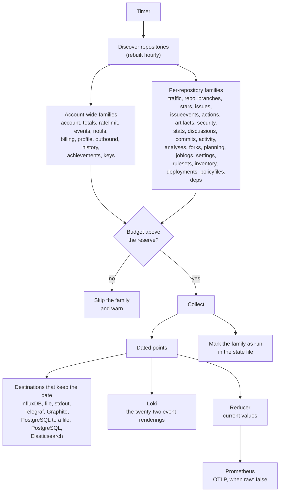

# How it works

Generated by `site/scripts/gen-docs.mjs` from the pages of the documentation site named under each heading below: do not edit this file. Change the page, and its Spanish twin beside it, then run `make docs`.

## The sweep

What one ghchronicle sweep over the GitHub API does, in what order, and why each family of metrics has its own cadence.

Source: <https://jmrp.io/docs/ghchronicle/how/>

A sweep is one pass over every family whose interval has elapsed. It is an
increment, not a rebuild: it asks for the little that can have changed since
last time, writes what it got to every configured store, and records when each
family ran.

### The shape of one pass



Two things in that diagram are the whole design. Every collector produces
_dated_ points, and the stores that cannot hold a date get them reduced to
current values first, by the same reducer, before they ever see the data. That
is the subject of [dating a point](https://jmrp.io/docs/ghchronicle/how/dating/).

### Why families and not one interval

The surfaces move at wildly different speeds. Workflow runs finish every few
minutes on a busy account. The contribution calendar changes once a day. The
list of forks changes a few times a year. One interval for all of them would
either waste the rate limit on the slow ones or lose the fast ones, so each
family carries its own.

| Family          | Default | Collects                                                       |
| --------------- | ------- | -------------------------------------------------------------- |
| `actions`       | 15m     | Workflow runs, jobs, steps, the Actions cache                  |
| `ratelimit`     | 15m     | What the collector has left to spend, in each budget            |
| `activity`      | 30m     | The repository activity log, where a force push is recorded    |
| `events`        | 30m     | The account event feed, which keeps only the last 300          |
| `notifs`        | 30m     | The notification inbox                                          |
| `artifacts`     | 1h      | Artifacts and their expiry                                      |
| `commits`       | 1h      | Lines changed and signature state, per commit                  |
| `deployments`   | 1h      | Deployments and their environments, batched over every repository |
| `issueevents`   | 1h      | The timeline of what moved: labels, assignments, transitions   |
| `issues`        | 1h      | Pull requests, issues and reviews, per item                    |
| `repo`          | 1h      | Stars, forks, languages, topics, releases, rulesets            |
| `security`      | 1h      | Dependabot and code scanning alerts                            |
| `discussions`   | 2h      | The forum half of a repository                                 |
| `analyses`      | 6h      | Code scanning analyses, which GitHub prunes                    |
| `billing`       | 6h      | Usage per day, product, SKU and repository                     |
| `planning`      | 6h      | Labels and milestones                                          |
| `settings`      | 6h      | Webhooks and their deliveries, environments, deploy keys       |
| `stars`         | 6h      | Stars per day for every repository, and the stargazer walk once, then the newest hundred |
| `traffic`       | 6h      | The whole 14-day window, rewritten                             |
| `account`       | 12h     | Profile, contribution calendar, contribution totals            |
| `forks`         | 12h     | Who forked, and when                                            |
| `outbound`      | 12h     | Stars given, and work in other people's repositories           |
| `profile`       | 12h     | Packages, gists, social accounts                               |
| `stats`         | 12h     | Commits per week, the punch card, the workflow definitions     |
| `totals`        | 12h     | The lifetime numbers, asked of GitHub rather than added up here |
| `achievements`  | 24h     | The profile badges, and the distance to each next tier         |
| `branches`      | 24h     | Which branches are live and how stale each tip is              |
| `inventory`     | 24h     | What a workflow's own token may do, both secret stores, default code scanning |
| `keys`          | 24h     | The account's SSH and GPG keys, and when each expires          |
| `policyfiles`   | 24h     | SECURITY.md, CODEOWNERS, dependabot.yml and FUNDING.yml        |
| `rulesets`      | 24h     | Every version of every ruleset's changelog                     |
| `deps`          | off     | The dependency SBOM of each repository, and what changed       |
| `history`       | off     | Each year's contribution calendar, the current one included    |
| `joblogs`       | off     | The tail of every failed job's log                             |

Setting any of them to `0` switches it off entirely. See
[cadences](https://jmrp.io/docs/ghchronicle/configuration/cadences/).

### Discovery

The repository list is rebuilt at most once an hour. Repositories are created
rarely and listing them costs a page per hundred, so anything shorter spends
quota to learn nothing. Forks and archived repositories are excluded by
default, for the reason set out in [targets](https://jmrp.io/docs/ghchronicle/configuration/targets/).

### Failure is per repository, not per sweep

A family that fails on one repository is logged and skipped; the sweep
continues. This matters more than it sounds, because "failure" here is usually
a feature being switched off: of fifty repositories, most have Dependabot off,
and each of them answers 403. Treating that as an error would lose the other
forty-nine.

There is one exception, and it is deliberate. A family where _every_ repository
failed is not marked as run. Marking it would hide the outage until the next
cadence, which for the twelve-hour families is half a day.

```text
level=WARN msg="family failed everywhere, not marking it as run" family=security
```

### The state file

`state_file` holds [seven things](https://jmrp.io/docs/ghchronicle/configuration/#state_file), and
the two a sweep is judged by are when each family last ran and when each
repository was first seen.

The second is what makes the one-off full walk of the stargazer list happen
once instead of on every sweep, as `history_read` does for the daily star
history. It is written through a temporary file and renamed,
so a crash mid-write cannot leave a truncated state that would trigger a full
re-collection.

> **Three runs collect every family whatever the state says**
>
> An exporter holds its samples in memory, so a restart empties it and it stays
> empty until each family's cadence comes round, which for the twelve-hour ones
> is half a day of a dashboard reading zero. Paying for one full sweep is the
> cheaper mistake, so the first sweep after start-up runs every enabled family
> whatever the state file says. A [backfill](https://jmrp.io/docs/ghchronicle/how/backfill/) does
> the same, because reaching as far back as GitHub allows is the whole point of
> asking for one, and so does a run drawing [a card](https://jmrp.io/docs/ghchronicle/card/),
> because every number on the card comes from that one sweep and a family
> skipped as not due would be a zero on the picture.

### The brake

Before each family the collector checks the three rate buckets it actually
spends from. If any of them is at or below its reserve and the window has not
reset yet, the family is skipped and a warning is logged rather than the budget
being spent to the last call. See [rate limits](https://jmrp.io/docs/ghchronicle/api/).

A [backfill](https://jmrp.io/docs/ghchronicle/how/backfill/) is the opposite intention: it waits for
the window to turn over instead of skipping.

## Dating a point

Every point carries the moment the thing happened, and that single rule decides what the whole project can answer.

Source: <https://jmrp.io/docs/ghchronicle/how/dating/>

**A point carries the date the thing happened, not the date it was collected.**

That is the one rule everything else follows from. A workflow run is stamped
when it finished. A star is stamped when it was given. A traffic day is stamped
at that day's own date. A pull request is stamped when it closed. None of them
is stamped at the instant the collector noticed.

### The three kinds of point

Not everything GitHub reports has a date of its own, so there are three
treatments and each measurement declares which one it gets.

| Kind      | Stamped at                    | Example                                                         |
| --------- | ----------------------------- | --------------------------------------------------------------- |
| **Dated** | the moment the thing happened | `gh_star`, `gh_workflow_run`, `gh_traffic`, `gh_commit`         |
| **Daily** | the start of the UTC day      | `gh_traffic_referrer`, `gh_label`, `gh_milestone`, `gh_webhook` |
| **Now**   | the instant of the sweep      | `gh_repo`, `gh_actions_cache`, `gh_dependabot_alert`            |

Daily is for a snapshot with no date of its own. GitHub returns the top ten
referrers of the trailing fourteen days as one list with no day attached, so it
is not a series. Stamping it at the instant of the sweep would write four
copies a day and any query that summed them would report four times the
traffic. Stamping it at the start of the UTC day means a day's sweeps rewrite
one row.

Now is for something that is genuinely a current state. The size of the Actions
cache, the number of open alerts, the inventory of workflows: none of these
happened at a moment, so pretending otherwise would be a lie with a timestamp
on it.

### Why the rule exists: re-collection has to converge

InfluxDB keys a point by measurement, tag set and timestamp. Three fields, one
row. Write the same three again and the row is replaced, not added to.

Written out, two sweeps six hours apart offer the same day twice, and the
second replaces the first because the three keys are identical:

```text
gh_traffic,owner=acme,repo=telemetry,kind=views count=220i,uniques=131i 1757203200000000000
gh_traffic,owner=acme,repo=telemetry,kind=views count=238i,uniques=140i 1757203200000000000
```

```text
gh_traffic,owner=acme,repo=telemetry,kind=views count=238i,uniques=140i 1757203200000000000
```

One row, carrying the newest number GitHub reported for that day. Stamp those
two lines at the moment of collection instead and they are two rows, and every
sum over them is wrong by however many sweeps have run.

That is what makes the whole design work. GitHub's traffic window is fourteen
days, and the collector rewrites _all fourteen_ on every sweep rather than
trying to work out which day is new:

GitHub keeps 14 days of traffic and the collector re-reads all of them 4 times a day. Dated as built, those 4 sweeps land on the same 14 rows and the newest count replaces the one before it. Stamped at the moment of collection, each sweep adds what it read to what is already there.

| After a week, per repository | Dated, as built | Stamped at collection |
| --- | --- | --- |
| Rows written per sweep | 14 | 14 |
| Rows in the store | 14 | 392 |
| Copies of each day | 1 | 28 |
| A sum of the month's views | the traffic | 28 times the traffic |

The same property is what makes a backfill safe to run twice, and what lets you
delete the state file without corrupting anything: re-collection rewrites rows
it has already written.

> **Every history store has this property**
>
> It is not InfluxDB-specific. The SQL sink's primary key is `(time, tag
> columns)`, which is the same series key spelled as a constraint, and its
> inserts end in `ON CONFLICT ... DO UPDATE` rather than `DO NOTHING`.
> Elasticsearch derives the document id from the measurement, the tags and the
> timestamp, and indexes rather than creates. Graphite writes into the whisper
> slot the timestamp names. All four converge for the same reason.

### What Prometheus structurally cannot hold

Prometheus stamps a sample at scrape time. It does not take a timestamp from
the producer, and it rejects anything meaningfully older than now.

This was measured rather than assumed. Against **Prometheus 3.14**, with
`--web.enable-otlp-receiver` and `out_of_order_time_window: 30m`, a sample
dated two days back comes back as **HTTP 400**.

Half of what this collects is older than that on purpose: a star from 2020, a
pull request merged in July, yesterday's traffic. So there is no configuration
of Prometheus in which the dated history survives. Widening the out-of-order
window moves the boundary; it does not remove it.

> **Do not give the exporter timestamps**
>
> The obvious "fix" is to have the exporter emit each sample with the point's
> own timestamp. Prometheus's exposition format allows it, and Prometheus will
> refuse the ones that matter. The exporter deliberately drops the timestamp,
> and the reduction below is why that is not a loss.

### The reducer, and what it makes of each measurement

Because the store cannot hold the history, the reduction happens _before_
Prometheus or an OTLP backend with `raw: false` ever sees the data.
`Summarize` gives each measurement one of four rules.

| Rule       | What it does                                                  | Used for                                                                     |
| ---------- | ------------------------------------------------------------- | ---------------------------------------------------------------------------- |
| `keepLast` | The most recent point per label set wins                      | Snapshots: `gh_repo`, `gh_account`, `gh_release`                             |
| `sum`      | Every point in the batch is added up                          | Windows: views over the fourteen days                                        |
| `count`    | The points become a count plus the mean of each numeric field | Dated items: pull requests become "how many merged" and "how long they took" |
| `skip`     | Nothing is served                                             | History with no honest current value                                         |

A measurement with no rule is skipped rather than guessed at. That is the safe
default, and it is deliberate: without it, a new collector could quietly flood
an exporter with one series per star.

`count` averages each of their numbers except the identifiers. A field that
joins one row to another, `run_id`, `workflow_id`, `pull_request`, `number`,
`stack` and the rest, is a name and not a quantity: averaged over a count it
becomes a number shaped exactly like the identifier it is made of and belonging
to nothing, and `gh_deployment` published `run_id_mean` that way. Those fields
are left out of the reduction, and so are the markers a point carries only so
that it has a field at all, whose mean is 1.0 for ever.

The reducer also publishes `total`, a running count of distinct items seen per
series. That is what lets a Prometheus dashboard answer "per day" at all, through
`increase()` over a monotonic counter, since it has no rows to count.

#### The eleven that are never served

Eleven of the measurements carry `skip`, so a Prometheus exporter and an OTLP
backend with `raw: false` never see them. Eight are history, two are size, and
one is text:

| Measurement                | Why                                                                                   |
| -------------------------- | ------------------------------------------------------------------------------------- |
| `gh_artifact`              | History. One row per artifact ever, and none of them moves again                      |
| `gh_commit_punchcard`      | Size. One series per repository, weekday and hour                                     |
| `gh_commits_week`          | History. The weekly commit series                                                     |
| `gh_contribution_day`      | History. The green calendar, one row per day                                          |
| `gh_contribution_day_repo` | History. The same calendar split per repository, which would mint a series per day    |
| `gh_job_log`               | Text, not a number. It belongs in a log store                                         |
| `gh_package_version`       | History. The publication date of every tag; the count of them is a field on `gh_package` |
| `gh_release_asset`         | Size. One series per file ever published                                              |
| `gh_star_day`              | History. Stars per day, revised backwards when a star given in the last thirty weeks is taken back; the count is `gh_repo.stars` |
| `gh_traffic_path`          | History. The per-day paths                                                            |
| `gh_workflow_step`         | History. The per-step timings                                                         |

The two skipped for size are the ones worth knowing about, because they are
real numbers rather than history: measured, together they were four fifths of
the exporter's entire output. Both are drawn properly by the InfluxDB
dashboard, and `gh_release` keeps the per-release download counts the assets
were being read for.

### Which store keeps what

| Store                                         | The dated history           | Why                                                                                                 |
| --------------------------------------------- | --------------------------- | --------------------------------------------------------------------------------------------------- |
| InfluxDB, PostgreSQL, Graphite, Elasticsearch | yes                         | The timestamp is part of the identity of a row                                                      |
| Telegraf                                      | as far as its outputs allow | It forwards the timestamps unchanged; an output that stamps at receipt loses them                   |
| File and stdout                               | yes                         | The timestamp is in the line                                                                        |
| Loki                                          | recent events only          | Loki refuses an entry too far behind the newest in its stream. See [Loki](https://jmrp.io/docs/ghchronicle/sinks/loki/) |
| OpenTelemetry                                 | the backend decides         | OTLP data points carry an explicit timestamp; whether it is honoured is not up to this tool         |
| Prometheus                                    | no                          | Current values only, by the rules above                                                             |

### Three consequences worth knowing

**A tag is a series, a field is a value.** Anything unbounded goes in a field.
The Actions runner name looks like a good tag until you notice a hosted runner
is named uniquely per run (`GitHub Actions 1000163135`), which would create a
series for every job ever executed. It is a field.

**Weekly rows are anchored to the week, not to today.** `gh_commits_week` is
stamped at the Sunday that starts each week. A sweep on Tuesday and one on
Friday have to land on the same row, or every re-read writes a second copy of
the year. `gh_star_day` is anchored the same way, each day the `week` GitHub
returns plus its index. The day is GitHub's own calendar day in
America/Los_Angeles, measured rather than documented, and the row is stamped at
00:00 UTC of that date, so a star given on a European morning can sit a day
before the instant `gh_star` gives it.

**Prometheus reserves some tag names.** A tag called `job` or `instance`
collides with the scrape labels, and the OTLP receiver overwrites it with the
service name. Workflow jobs are therefore tagged `job_name`.

## Backfill

One deliberate walk to the end of every surface, how far back it goes, and the three things no backfill can reach.

Source: <https://jmrp.io/docs/ghchronicle/how/backfill/>

A backfill walks every GitHub surface back as far as the API answers, once, so the history starts before the first sweep.

```sh
ghchronicle -config config.yaml -backfill
```

A sweep is an increment. A backfill is a walk. They are opposite intentions and
the tool treats them as such.

### The difference in one table

|                             | Sweep                             | Backfill                                           |
| --------------------------- | --------------------------------- | -------------------------------------------------- |
| Pages per collector         | the collector's own small default | until the API runs out, or the bound is reached    |
| When the reserve is reached | skip the family and warn          | wait for the window to reset, then carry on        |
| Which families run          | those whose interval has elapsed  | every enabled family, whatever the state file says |
| When it is stopped          | nothing to keep; the next tick sweeps | a checkpoint keeps its place, and the same command carries on |
| How often                   | on a schedule, forever            | deliberately, usually once                         |

A normal sweep must never block. It protects the reserve so whatever else uses
the same token keeps working, and it skips a family rather than sleeping. A
backfill is run on purpose and the only thing that matters is that it finishes,
so it parks until the budget is whole again. And a backfill that is stopped
half way keeps its place, so the same command started again carries on from
there rather than from the first repository.

### Stopping one, and picking it up again

A walk of a real account is hours long, and a reason to stop it turns up: the
author's own had been going six and a half hours when the binary underneath it
had to be replaced. Stopping it used to cost the whole walk.

The place is kept in a file beside the state file, named after it with
`-progress.json` instead of `.json`. Nothing configures it. It is written after
every repository rather than after every family, and that is measured rather
than preferred: on an account of fifty nine repositories the account wide
families take four minutes between them, and then `actions` takes two hours and
three quarters and `commits` longer still, so a checkpoint at the end of each
family would keep the four minutes and throw away the rest.

What it records is what has been delivered. A repository goes into it only once
its whole walk has reached every configured sink, which is what makes skipping
it on the way back safe: there is no tail of its own pagination left anywhere.
A repository whose collector failed, or whose rows a store refused, is not
recorded, and the walk comes back to it. Coming back to it costs requests and
nothing else, because a point carries the date the thing happened and
re-collection rewrites the same rows.

```text
level=INFO msg="backfill stopped, and what it had written is kept" file=/var/lib/ghchronicle/backfill-progress.json running_for=6h40m7s families_complete=9 family=actions repositories_written=23 resume="run the same command again"
```

The file itself is meant to be read, and says the same thing at more length:
the families that finished and when, the family that was in flight, and which
of its repositories are done. It is removed when the walk has covered every
family it was asked for, so a checkpoint that exists is a walk with work left
in it.

Reaching the end without an error is not the same thing. A family truncated by
a secondary rate limit is handed back as a pass rather than as a failure, and a
family that failed on every repository is deliberately left unmarked; a walk
can finish tidily with either of those behind it. The checkpoint stays, and the
line at the end names the families still to do.

An ordinary sweep keeps none of this. It writes no checkpoint and reads none:
the state file it keeps is about cadences, and a half walked backfill has no
business in it.

#### The two things it refuses

**A checkpoint it cannot read.** A machine that loses power can leave an empty
or half written file behind. The run stops with a sentence naming it rather
than starting the walk over in silence: what the file lists may be hours of
somebody's history, and starting over is the answer that looks like success.

**A checkpoint from a different walk.** The file records what the walk was
asked for: the API it reads, the targets, the families that were enabled, the
date bound exactly as it was spelled, and the stores it writes to. If one of
those changed between the stop and the resume, the list of repositories not to
walk again means something else, and the run stops and names the setting that
changed.

The stores are there because a record in this file means the rows reached every
sink, and every sink means the ones that process had. Add a store while the
walk is stopped and the resume skips everything the first half recorded, so the
new store ends up holding the tail of the walk and nothing before it. Point an
existing one somewhere else and the same hole opens in a different place. Only
the settings you can read are compared: a store's password is never written
into this file.

The bound is the one that would go wrong quietly. A walk bounded at a year
records its repositories as written; an unbounded resume would skip every one
of them and leave a store that looks complete and stops a year back, with
nothing in the rows to say so.

Both refusals leave the file where it is. Put the setting back to carry on, or
delete the file to walk again from the first repository.

Replacing the binary is not one of them. That is the thing that stopped the
walk this was written for, so a checkpoint written by another build is resumed,
with a line saying which build wrote what it names.

#### Seeing how far it has got

```sh
ghchronicle -config config.yaml -backfill-status
```

It reads the checkpoint and prints it: when the walk began, how long ago it
last recorded anything, how many families are complete out of how many, the
family it was inside and how far into it, and the command that carries it on.
It asks GitHub nothing and writes nothing, so it is safe to run while a walk is
going, and it needs no token: the credential is there because a sweep asks
GitHub, and this asks nobody. When there is no walk in progress it says so and
names the file it looked for.

#### Going back on its own

A pass can end with families left and no error at all. The usual reason is a
few minutes of bad weather at the other end: a `502` on two repositories out of
sixty leaves their family unmarked, and the walk ends tidily with one family
short.

```sh
ghchronicle -config config.yaml -backfill -backfill-retry 1h
```

waits an hour and goes back for whatever is left, and keeps doing that until
there is nothing left. It costs almost nothing, because a resume walks only what
the checkpoint does not already hold: two repositories out of sixty, not sixty.

It stops on its own when **a pass records nothing new**. That is the whole rule,
and it is deliberately not a list of which errors are worth retrying: a
repository that was deleted fails the same way every hour, and a list of
retryable statuses is wrong the moment GitHub answers something it did not
answer before. A pass that gains nothing is a pass whose obstacle waiting does
not clear. There is also a cap of ten passes, as a backstop rather than a knob.

Without the flag nothing waits and nothing goes back, which is what it did
before this existed.

### The cooldown

When a bucket is at or below its reserve, the backfill waits. The wait is not
guessed: every GitHub response says exactly when its window resets, so the
collector sleeps until that instant plus a second of slack, and logs what it is
doing.

```text
level=INFO msg="rate limit reserve reached, waiting for the window to reset" family=commits wait=23m11s
```

Two guards on that wait. It is capped at one hour, so a clock skew or a stale
header cannot turn into an unbounded sleep, and it has a floor of one second,
so it cannot become a busy loop. A cancelled context ends the wait immediately,
which is what makes `Ctrl+C` work during an overnight backfill.

### How far back

`-backfill-since` on the command line, or `backfill.since` in the configuration
file. Four spellings, because people reach for different ones:

| Value                     | Means                    |
| ------------------------- | ------------------------ |
| `2024-01-01`              | that date                |
| `90d`                     | ninety days ago          |
| `2y`                      | two years ago            |
| `720h`                    | a Go duration before now |
| empty, `all`, `unlimited` | no bound at all          |

No bound means the walk stops only where the API does, however many hours or
days that takes, pausing at every rate limit reset along the way.

```sh
ghchronicle -config config.yaml -backfill -backfill-since 2y
```

### Run it once, first

A new install should run a backfill before, or right after, starting the
service. A sweep's first pass is a wider increment, not a history: a month of
workflow runs, the star history in full, and the newest page of everything
else. The points are dated, so every store is fine with that; a dashboard at
ninety days or two years is not, because the history it draws begins on the
day the collector was installed.

Measured after a day of sweeps and no backfill, over repositories holding
hundreds of pull requests each: pull requests, about a fifth of what the
repositories report, because a sweep reads one page of fifty per repository
however many it holds; issues, about half; commits, well under a tenth and none
older than thirty days; jobs and steps for a tenth of the workflow runs, so the
queue wait, the slowest jobs and the steps that fail were computed over that
tenth. At two years, _Pull requests merged_ read a fifth of what _Pull requests
merged, ever_ said. Stars and forks were complete, because the first sweep
walks those to the end anyway, and so were releases, deployments and the
alerts, because none of those repositories had more than the hundred of each
that a sweep reads.

### What it reaches that a sweep does not

- The whole commit history, rather than the last page. This is the one family
  where a backfill is qualitatively different rather than merely wider: without
  it the lines-changed series begins on the day you installed the collector.
- Every workflow run GitHub still holds, each expanded into its jobs, and into
  its steps while GitHub still serves them. Measured on 24 September 2026,
  GitHub listed every job of a run 278 days old, but no steps for any run
  created before 12 April, about five and a half months back. Such a job, if
  it finished as success, failure or timed out, is written with no `steps`
  field rather than a 0, since it ran at least one.
- The archived repositories, in full, whatever `include_archived` says. Their
  history is the account's history and it never moves again, which is exactly
  why a sweep leaves them out and why one walk of them is enough. Forks stay
  as configured. What does still move on an archived repository, its stars,
  forks and watchers, a sweep reads without a backfill: the listing it already
  pays for says which repositories are archived, and every `totals` sweep asks
  about all of them, one query per twenty five, for two rows each. One is
  `gh_repo_archived`, dated when the repository was archived. The other is its
  `gh_repo_total`, stamped at the sweep like a collected repository's, and
  that is the row the account's star and fork totals are read from.
- Every pull request and issue, in pages of fifty, where a sweep reads what
  changed since the sweep before and one whole page a day.
- Every pull request and issue the account opened in other people's
  repositories that has since been merged or closed, in pages of a hundred
  ordered by when each one last moved, where a sweep reads each of the three
  closed states back to a cadence before the sweep before. That is enough for
  a sweep because a merge or a close moves the item to the top, however long
  ago it was opened, and it is one page unless more than a hundred items
  moved in that time; a sweep that read one page and no more lost the item
  that a hundred later updates, a bot locking old threads or a relabel, had
  pushed onto the second. The ones still open are bounded by neither a page nor a date:
  every sweep reads them all, since each one gets a row for every day it stays
  open. In 2.5.1 and earlier each of the five searches read its newest
  hundred and stopped, on a sweep and on a backfill alike.

  GitHub serves a thousand results of any search and no more, so an account
  past a thousand in one of those states keeps the thousand that moved most
  recently. That is said in the log, once per count, rather than left to show
  as two panels that disagree:

  ```text
  level=WARN msg="outbound search read fewer items than it counts, GitHub serves a thousand at most" kind=pull_request state=merged count=2860 read=1000
  ```

- Every page of artifacts, of repository activity and of code scanning
  analyses, where a sweep reads five, two and one.
- Every release, deployment and discussion, and every Dependabot and code
  scanning alert, where a sweep reads the newest page of each list.
- Every page of every stargazer list, where a sweep reads the newest hundred
  stars of a repository whose list it has walked whole once. Up to 2.5.0 a
  first walk that failed was recorded as done, and a backfill read a recorded
  list by its first and last pages, so the stars in between were never read;
  a backfill now reaches them.
- The whole inbox, read threads included, where a sweep reads the unread
  threads that moved and, once a day, twenty pages of fifty with the read ones.
- Every month of billing GitHub still answers, until three empty months in a
  row, where a sweep reads two.
- The newest hundred webhook deliveries per hook, where a sweep reads thirty.
- At most 500 failed job logs per repository, none older than ninety days,
  once `joblogs` has a cadence; a sweep reads at most ten.

### What it does not switch on

A backfill runs every enabled family whatever the state file says. It enables
none of them. The three families that ship with a cadence of `0`, `deps`,
`history` and `joblogs`, stay off unless they have been given one by name under
`every.families`, and `-backfill` does not change that.

`history` is the one that surprises people, because walking every past year of
the contribution calendar is exactly what somebody asking for "the whole
history" has in mind. Give it a cadence first:

```yaml
every:
  families:
    history: 24h
```

See [cadences](https://jmrp.io/docs/ghchronicle/configuration/cadences/) for why `default` and
`groups` cannot switch these three on either.

### Two endpoints that needed their own handling

Both were found by running it, not by reading documentation.

**Dependabot refuses page numbers.** It answers an error to `page=` outright
and pages by cursor instead, so the alert walk is written against cursors.

**The GraphQL gateway gives up on a hundred pull requests.** Asking for a
hundred pull requests with their reviews in one query answers an **HTML 502**
after about ten seconds. The pull request walk halves its page size and retries
on the same cursor, silently: the collectors carry no logger, so a backfill of a
busy repository shows this only as a slower family, never as a line.

> **Three things cannot be backfilled at any price**
>
> No amount of waiting changes these, and they are the reason the project exists
> at all.
>
> - **The event feed keeps three hundred events**, and none older than thirty
>   days. Past that ceiling GitHub answers 422 "pagination is limited for this
>   resource", which the collector reads as the end of the data.
> - **Traffic is fourteen days.** Anything older was never stored by GitHub.
> - **Job logs are deleted after the repository's retention period**, ninety
>   days by default, and answer 410 afterwards. A backfill of `joblogs` asks
>   only for the last ninety days, whatever the setting. The runs they belong
>   to were kept for four hundred days or more; from 1 October 2026 GitHub
>   applies the same retention setting to the runs themselves: ninety days by
>   default, at most ninety on a public repository and up to four hundred on a
>   private one, so a backfill after that date reaches only as far back as
>   that setting.

### Running one safely

It is idempotent. Points are keyed by measurement, tags and timestamp, so a
backfill run twice rewrites the same rows rather than doubling them, in every
store that keeps the history. What it costs is API quota and time.

Two things worth doing first: run `-list` to confirm the repository set, and
check that the store you are writing to is the one that keeps dates. Backfilling
into Prometheus collects a great deal of history and then reduces all
of it to a single current value.
