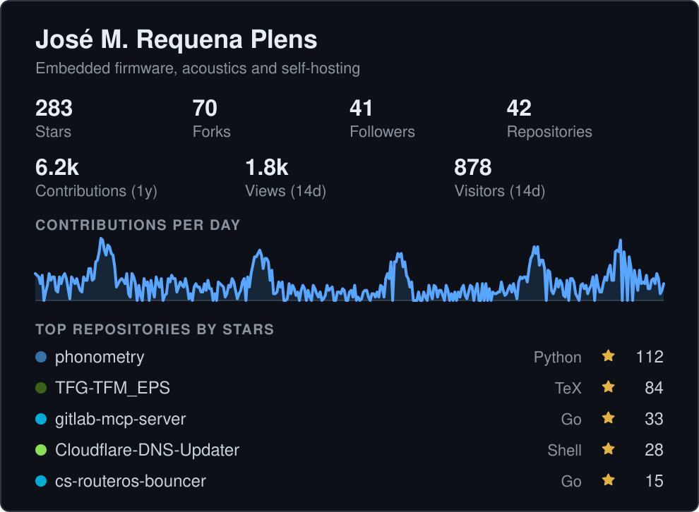
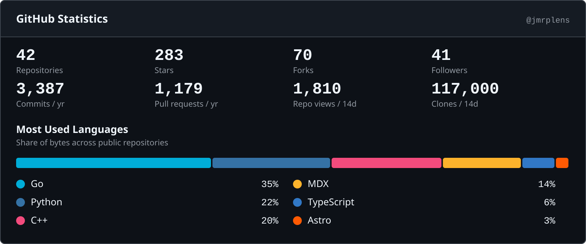
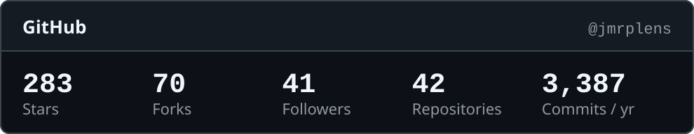
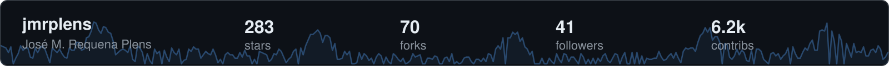
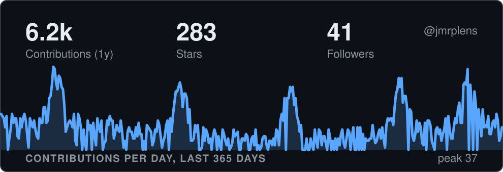
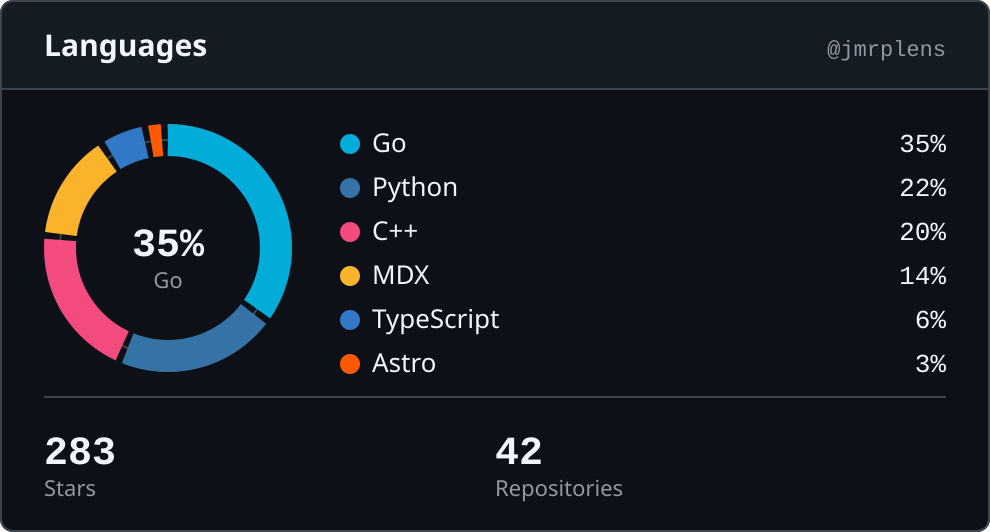
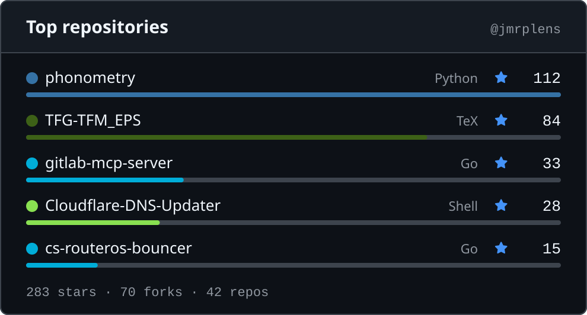
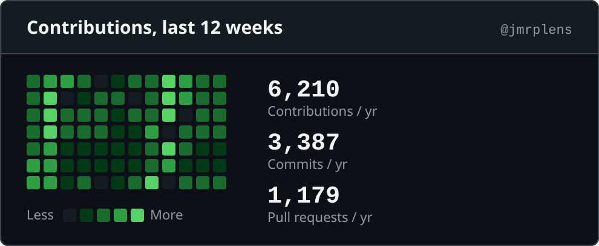
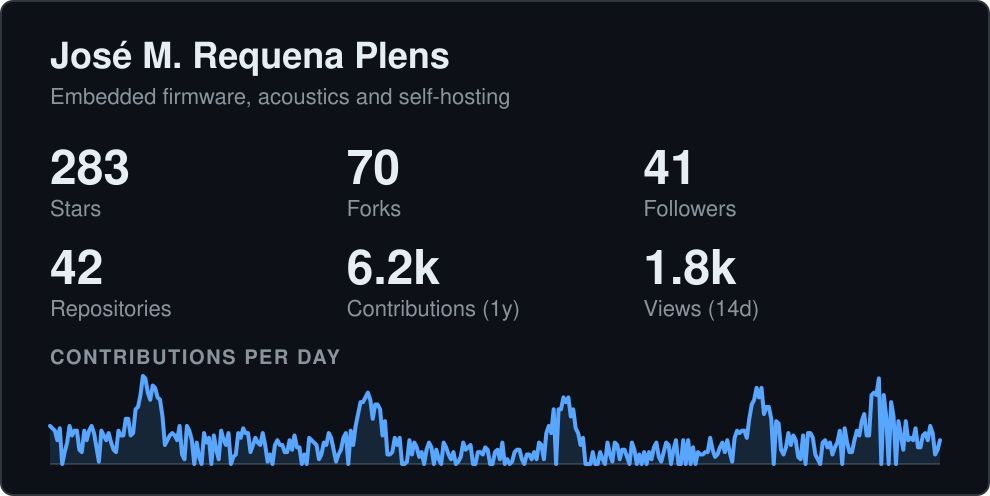

import { Aside } from "@astrojs/starlight/components";

```sh
ghchronicle -card-layouts
```

Los imprime con los campos que muestra cada uno por omisión. Las capturas de
abajo son del tema oscuro; todos los diseños se dibujan también en claro, y
`auto` mete ambos en un fichero.

| Diseño              | Familia   | Animado | Campos por omisión                                                                   |
| ------------------- | --------- | ------- | ------------------------------------------------------------------------------------ |
| `summary`           | chronicle | no      | stars, forks, followers, repos, contributions, views, visitors, sparkline, top_repos |
| `github-stats`      | github    | no      | repos, stars, forks, followers, commits, pull_requests, views, clones, languages     |
| `github-compact`    | github    | no      | stars, forks, followers, repos, commits                                              |
| `badge-row`         | chronicle | no      | stars, forks, followers, repos, contributions                                        |
| `wide-banner`       | chronicle | sí      | stars, forks, followers, contributions, sparkline                                    |
| `sparkline-hero`    | chronicle | sí      | contributions, stars, followers, sparkline                                           |
| `language-ring`     | github    | no      | languages, stars, repos                                                              |
| `repo-list`         | github    | no      | top_repos, stars, forks, repos                                                       |
| `activity-heatmap`  | github    | no      | sparkline, contributions, commits, pull_requests                                     |
| `animated-counters` | chronicle | sí      | stars, forks, followers, repos, contributions, views, sparkline                      |

## Las dos familias

La familia **chronicle** es el aspecto propio de esta herramienta. La familia
**github** usa la paleta Primer de GitHub y números monoespaciados para que la
tarjeta encaje en un README de perfil como si la hubiera dibujado GitHub.

## summary

La tarjeta original: título, dos filas de números, un sparkline y los
repositorios con más estrellas.



## github-stats

La caja propia de GitHub: una banda de cabecera, filas de cuatro números
monoespaciados y una barra de reparto de lenguajes con su leyenda. El diseño más
ancho, con 800 píxeles, y el que parece más nativo en un README de perfil.



## github-compact

Una fila de números monoespaciados bajo una banda de cabecera fina.



## badge-row

Una fila de píldoras de 20 píxeles, una por número, para una línea de README. El
ancho sigue al contenido en vez de fijarse.


## wide-banner

Un banner de ancho completo y 60 píxeles de alto: el login a la izquierda, los
números repartidos, y el sparkline dibujándose solo por detrás.



## sparkline-hero

El sparkline de contribuciones es toda la tarjeta, con hasta tres números
superpuestos. La línea se dibuja sola al cargar.



## language-ring

Un donut de reparto de lenguajes con la leyenda al lado y una fila de números
destacados.



## repo-list

Los repositorios con más estrellas como contenido principal: punto de lenguaje,
estrellas y una barra por fila, con los totales debajo.



## activity-heatmap

Las últimas doce semanas del calendario de contribuciones como los cuadrados
verdes de GitHub, con hasta tres números al lado.



## animated-counters

Números que cuentan hacia arriba al cargar sobre un sparkline que se dibuja
solo, asentándose en la tarjeta estática.



<Aside type="note" title="El fotograma final es toda la tarjeta">
  La animación es CSS dentro del SVG, se reproduce una vez y se asienta, y el
  fotograma final es la tarjeta estática completa. Un renderizador que ignore la
  animación muestra el estado terminado, y `prefers-reduced-motion` la
  desactiva. Las capturas de arriba son esos fotogramas finales.
</Aside>

## Ancho

Cada diseño declara su propio ancho, y un mínimo por debajo del cual se negaría
a dibujar. Nada pide otro: `render.Options` tiene un campo `Width`, el binario
lo deja a cero y no hay forma de fijarlo desde fuera, así que cada tarjeta sale
con el ancho de su diseño. `badge-row` no declara ninguno de los dos, porque una
fila de píldoras estirada a un ancho fijo tendría huecos; su ancho sigue al
contenido.

## Campos que un diseño no puede dibujar

Cada diseño declara qué campos soporta. Pedir uno que no, como `top_repos` en
`github-compact`, lo descarta en silencio. Pedir un nombre que no está en el
vocabulario en absoluto es un error que lista los válidos.

Doce de los quince campos son números, y todos los diseños admiten los doce.
Solo están restringidos los tres que necesitan sitio propio:

| Campo        | Lo dibujan                                                         |
| ------------ | ------------------------------------------------------------------ |
| `languages`  | `summary`, `github-stats`, `language-ring`                         |
| `top_repos`  | `summary`, `github-stats`, `repo-list`                             |
| `sparkline`  | `summary`, `github-stats`, `wide-banner`, `sparkline-hero`, `activity-heatmap`, `animated-counters` |

`ghchronicle -card-layouts` imprime los diseños con los campos que dibuja cada
uno por omisión.

## Por dónde seguir

- [La tarjeta](/ghchronicle/es/card/) es lo que las dibuja, y cómo poner una en
  un README.
- [Llamarlo desde un programa](/ghchronicle/es/reference/subprocess/) es la
  forma soportada de sacar una desde otro lenguaje.
