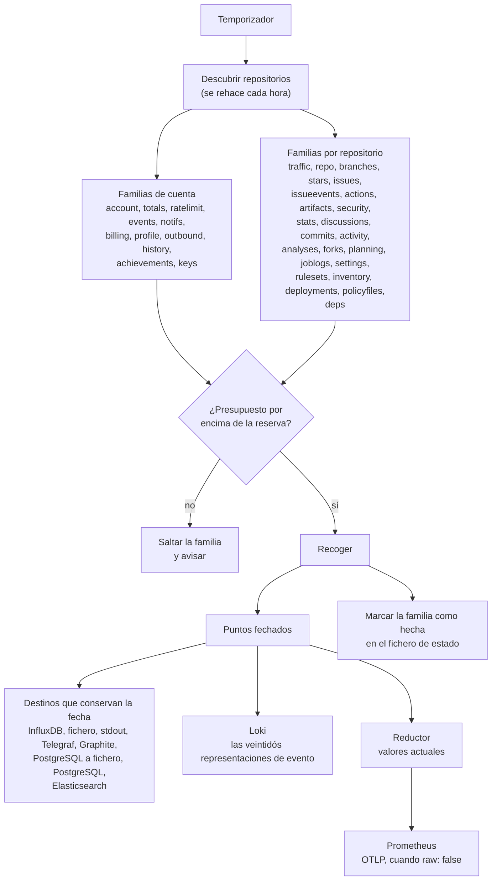

import { Aside } from "@astrojs/starlight/components";

Una pasada es un recorrido por cada familia cuyo intervalo ya ha vencido. Es un
incremento, no una reconstrucción: pide lo poco que puede haber cambiado desde
la vez anterior, escribe lo obtenido en todos los almacenes configurados y
anota cuándo corrió cada familia.

## La forma de una pasada



Dos cosas de ese diagrama son todo el diseño. Cada colector produce puntos
_fechados_, y los almacenes que no pueden sostener una fecha los reciben ya
reducidos a valores actuales, por el mismo reductor, antes de ver los datos.
Ese es el tema de [la fecha del punto](/ghchronicle/es/how/dating/).

## Por qué familias y no un intervalo único

Las superficies se mueven a velocidades muy distintas. Las ejecuciones de
workflows terminan cada pocos minutos en una cuenta activa. El calendario de
contribuciones cambia una vez al día. La lista de forks cambia unas pocas veces
al año. Un único intervalo para todas o malgastaría el límite de peticiones en
las lentas o perdería las rápidas, así que cada familia lleva la suya.

| Familia         | Por omisión | Recoge                                                             |
| --------------- | ----------- | ------------------------------------------------------------------ |
| `actions`       | 15m         | Ejecuciones de workflows, jobs, pasos, la caché de Actions         |
| `ratelimit`     | 15m         | Lo que le queda por gastar al colector, en cada presupuesto        |
| `activity`      | 30m         | El log de actividad del repositorio, donde queda un force push     |
| `events`        | 30m         | El feed de eventos de la cuenta, que guarda solo los últimos 300   |
| `notifs`        | 30m         | La bandeja de notificaciones                                        |
| `artifacts`     | 1h          | Artefactos y su caducidad                                           |
| `commits`       | 1h          | Líneas cambiadas y estado de la firma, por commit                  |
| `deployments`   | 1h          | Despliegues y sus entornos, en lote sobre todos los repositorios   |
| `issueevents`   | 1h          | La línea de tiempo de lo que se movió: etiquetas, asignaciones, transiciones |
| `issues`        | 1h          | Pull requests, issues y revisiones, uno a uno                      |
| `repo`          | 1h          | Estrellas, forks, lenguajes, temas, releases, rulesets             |
| `security`      | 1h          | Alertas de Dependabot y de code scanning                            |
| `discussions`   | 2h          | La mitad de foro de un repositorio                                  |
| `analyses`      | 6h          | Análisis de code scanning, que GitHub poda                          |
| `billing`       | 6h          | Uso por día, producto, SKU y repositorio                            |
| `planning`      | 6h          | Etiquetas e hitos                                                   |
| `settings`      | 6h          | Webhooks y sus entregas, entornos, claves de despliegue            |
| `stars`         | 6h          | Estrellas por día de cada repositorio, y el recorrido de la lista de estrellas una vez, luego las cien más nuevas |
| `traffic`       | 6h          | La ventana entera de 14 días, reescrita                            |
| `account`       | 12h         | Perfil, calendario de contribuciones, totales                       |
| `forks`         | 12h         | Quién hizo fork, y cuándo                                           |
| `outbound`      | 12h         | Estrellas dadas, y trabajo en repositorios ajenos                  |
| `profile`       | 12h         | Paquetes, gists, cuentas sociales                                   |
| `stats`         | 12h         | Commits por semana, el punch card, las definiciones de workflow    |
| `totals`        | 12h         | Las cifras de siempre, preguntadas a GitHub en vez de sumadas aquí |
| `achievements`  | 24h         | Los distintivos del perfil, y lo que falta para el siguiente nivel |
| `branches`      | 24h         | Qué ramas siguen vivas y cuánto hace que no se toca cada punta     |
| `inventory`     | 24h         | Qué puede hacer el token del propio workflow, los dos almacenes de secretos, el code scanning por omisión |
| `keys`          | 24h         | Las claves SSH y GPG de la cuenta, y cuándo caduca cada una        |
| `policyfiles`   | 24h         | SECURITY.md, CODEOWNERS, dependabot.yml y FUNDING.yml              |
| `rulesets`      | 24h         | Cada versión del historial de cada ruleset                          |
| `deps`          | apagada     | El SBOM de dependencias de cada repositorio, y lo que cambió       |
| `history`       | apagada     | El calendario de contribuciones de cada año, el actual incluido    |
| `joblogs`       | apagada     | La cola del log de cada job fallido                                 |

Poner cualquiera a `0` la apaga por completo. Ver
[cadencias](/ghchronicle/es/configuration/cadences/).

## El descubrimiento

La lista de repositorios se rehace como mucho una vez por hora. Los
repositorios se crean pocas veces y listarlos cuesta una página por cada cien,
así que cualquier cosa más corta gasta cuota para no aprender nada. Los forks y
los archivados quedan fuera por omisión, por la razón que se expone en
[objetivos](/ghchronicle/es/configuration/targets/).

## El fallo es por repositorio, no por pasada

Una familia que falla en un repositorio se registra y se salta; la pasada
continúa. Esto importa más de lo que parece, porque aquí "fallo" suele ser una
función apagada: de cincuenta repositorios, la mayoría tiene Dependabot
desactivado, y cada uno responde 403. Tratarlo como error perdería los otros
cuarenta y nueve.

Hay una excepción, y es deliberada. Una familia en la que fallaron _todos_ los
repositorios no se marca como hecha. Marcarla escondería la caída hasta la
siguiente cadencia, que para las familias de doce horas es medio día.

```text
level=WARN msg="family failed everywhere, not marking it as run" family=security
```

## El fichero de estado

`state_file` guarda [siete cosas](/ghchronicle/es/configuration/#state_file), y
las dos por las que se juzga una pasada son cuándo corrió cada familia por
última vez y cuándo se vio cada repositorio por primera vez.

Lo segundo es lo que hace que el recorrido completo de la lista de stargazers
ocurra una vez y no en cada pasada, como hace `history_read` con el historial
diario de estrellas. Se escribe a través de un fichero temporal
y se renombra, así que una caída a mitad de escritura no puede dejar un estado
truncado que provocaría una recolección completa.

<Aside type="note" title="Tres pasadas recogen todas las familias diga lo que diga el estado">
  Un exportador guarda sus muestras en memoria, así que un reinicio lo vacía y
  sigue vacío hasta que llega la cadencia de cada familia, lo que para las de
  doce horas es medio día de dashboard a cero. Pagar una pasada completa es el error
  más barato, así que la primera pasada tras el arranque corre todas las
  familias activas diga lo que diga el fichero de estado. Un
  [relleno](/ghchronicle/es/how/backfill/) hace lo mismo, porque llegar tan
  atrás como permita GitHub es justo lo que se le pide, y también una pasada que
  dibuja [una tarjeta](/ghchronicle/es/card/), porque cada número de la tarjeta
  sale de esa única pasada y una familia saltada por no tocarle sería un cero en
  la imagen.
</Aside>

## El freno

Antes de cada familia el colector mira los tres cubos de límite de los que
realmente gasta. Si alguno está en su reserva o por debajo y la ventana aún no
se ha reiniciado, la familia se salta y se registra un aviso en vez de gastar
el presupuesto hasta la última llamada. Ver
[límites de la API](/ghchronicle/es/api/).

Un [relleno histórico](/ghchronicle/es/how/backfill/) es la intención
contraria: espera a que la ventana se renueve en vez de saltarse la familia.
