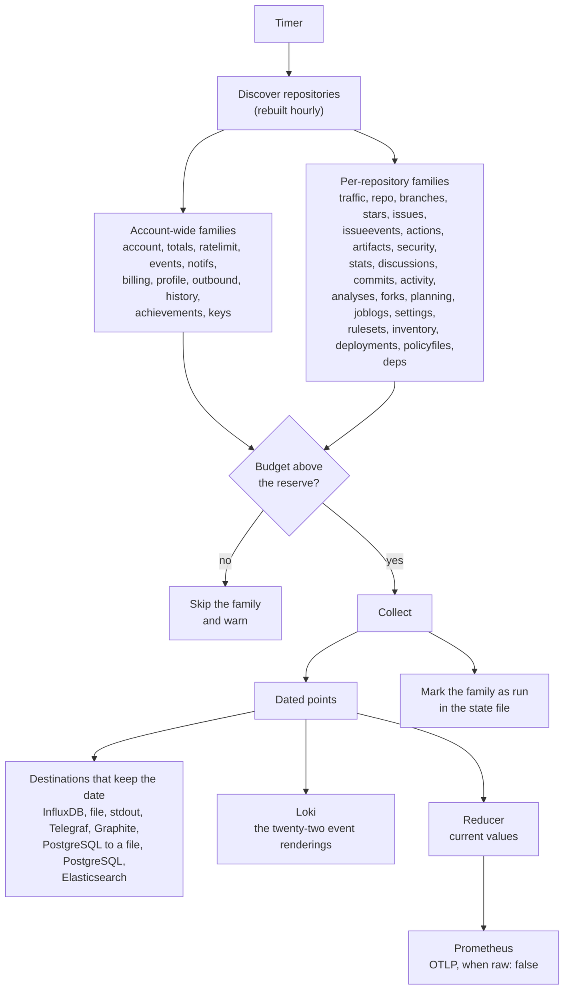

import { Aside } from "@astrojs/starlight/components";

A sweep is one pass over every family whose interval has elapsed. It is an
increment, not a rebuild: it asks for the little that can have changed since
last time, writes what it got to every configured store, and records when each
family ran.

## The shape of one pass



Two things in that diagram are the whole design. Every collector produces
_dated_ points, and the stores that cannot hold a date get them reduced to
current values first, by the same reducer, before they ever see the data. That
is the subject of [dating a point](/ghchronicle/how/dating/).

## Why families and not one interval

The surfaces move at wildly different speeds. Workflow runs finish every few
minutes on a busy account. The contribution calendar changes once a day. The
list of forks changes a few times a year. One interval for all of them would
either waste the rate limit on the slow ones or lose the fast ones, so each
family carries its own.

| Family          | Default | Collects                                                       |
| --------------- | ------- | -------------------------------------------------------------- |
| `actions`       | 15m     | Workflow runs, jobs, steps, the Actions cache                  |
| `ratelimit`     | 15m     | What the collector has left to spend, in each budget            |
| `activity`      | 30m     | The repository activity log, where a force push is recorded    |
| `events`        | 30m     | The account event feed, which keeps only the last 300          |
| `notifs`        | 30m     | The notification inbox                                          |
| `artifacts`     | 1h      | Artifacts and their expiry                                      |
| `commits`       | 1h      | Lines changed and signature state, per commit                  |
| `deployments`   | 1h      | Deployments and their environments, batched over every repository |
| `issueevents`   | 1h      | The timeline of what moved: labels, assignments, transitions   |
| `issues`        | 1h      | Pull requests, issues and reviews, per item                    |
| `repo`          | 1h      | Stars, forks, languages, topics, releases, rulesets            |
| `security`      | 1h      | Dependabot and code scanning alerts                            |
| `discussions`   | 2h      | The forum half of a repository                                 |
| `analyses`      | 6h      | Code scanning analyses, which GitHub prunes                    |
| `billing`       | 6h      | Usage per day, product, SKU and repository                     |
| `planning`      | 6h      | Labels and milestones                                          |
| `settings`      | 6h      | Webhooks and their deliveries, environments, deploy keys       |
| `stars`         | 6h      | The stargazer walk once, then the newest hundred               |
| `traffic`       | 6h      | The whole 14-day window, rewritten                             |
| `account`       | 12h     | Profile, contribution calendar, contribution totals            |
| `forks`         | 12h     | Who forked, and when                                            |
| `outbound`      | 12h     | Stars given, and work in other people's repositories           |
| `profile`       | 12h     | Packages, gists, social accounts                               |
| `stats`         | 12h     | Commits per week, the punch card, the workflow definitions     |
| `totals`        | 12h     | The lifetime numbers, asked of GitHub rather than added up here |
| `achievements`  | 24h     | The profile badges, and the distance to each next tier         |
| `branches`      | 24h     | Which branches are live and how stale each tip is              |
| `inventory`     | 24h     | What a workflow's own token may do, both secret stores, default code scanning |
| `keys`          | 24h     | The account's SSH and GPG keys, and when each expires          |
| `policyfiles`   | 24h     | SECURITY.md, CODEOWNERS, dependabot.yml and FUNDING.yml        |
| `rulesets`      | 24h     | Every version of every ruleset's changelog                     |
| `deps`          | off     | The dependency SBOM of each repository, and what changed       |
| `history`       | off     | Each year's contribution calendar, the current one included    |
| `joblogs`       | off     | The tail of every failed job's log                             |

Setting any of them to `0` switches it off entirely. See
[cadences](/ghchronicle/configuration/cadences/).

## Discovery

The repository list is rebuilt at most once an hour. Repositories are created
rarely and listing them costs a page per hundred, so anything shorter spends
quota to learn nothing. Forks and archived repositories are excluded by
default, for the reason set out in [targets](/ghchronicle/configuration/targets/).

## Failure is per repository, not per sweep

A family that fails on one repository is logged and skipped; the sweep
continues. This matters more than it sounds, because "failure" here is usually
a feature being switched off: of fifty repositories, most have Dependabot off,
and each of them answers 403. Treating that as an error would lose the other
forty-nine.

There is one exception, and it is deliberate. A family where _every_ repository
failed is not marked as run. Marking it would hide the outage until the next
cadence, which for the twelve-hour families is half a day.

```text
level=WARN msg="family failed everywhere, not marking it as run" family=security
```

## The state file

`state_file` holds [six things](/ghchronicle/configuration/#state_file), and
the two a sweep is judged by are when each family last ran and when each
repository was first seen.

The second is what makes the one-off full walk of the star history happen once
instead of on every sweep. It is written through a temporary file and renamed,
so a crash mid-write cannot leave a truncated state that would trigger a full
re-collection.

<Aside type="note" title="Three runs collect every family whatever the state says">
  An exporter holds its samples in memory, so a restart empties it and it stays
  empty until each family's cadence comes round, which for the twelve-hour ones
  is half a day of a dashboard reading zero. Paying for one full sweep is the
  cheaper mistake, so the first sweep after start-up runs every enabled family
  whatever the state file says. A [backfill](/ghchronicle/how/backfill/) does
  the same, because reaching as far back as GitHub allows is the whole point of
  asking for one, and so does a run drawing [a card](/ghchronicle/card/),
  because every number on the card comes from that one sweep and a family
  skipped as not due would be a zero on the picture.
</Aside>

## The brake

Before each family the collector checks the three rate buckets it actually
spends from. If any of them is at or below its reserve and the window has not
reset yet, the family is skipped and a warning is logged rather than the budget
being spent to the last call. See [rate limits](/ghchronicle/api/).

A [backfill](/ghchronicle/how/backfill/) is the opposite intention: it waits for
the window to turn over instead of skipping.
